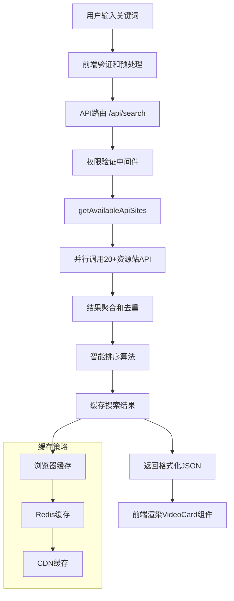
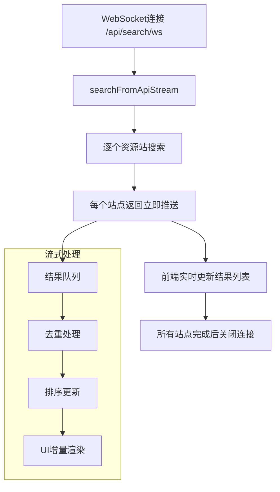
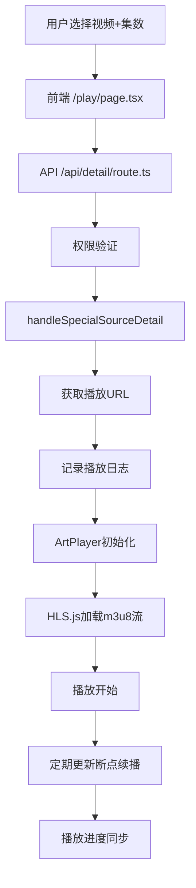
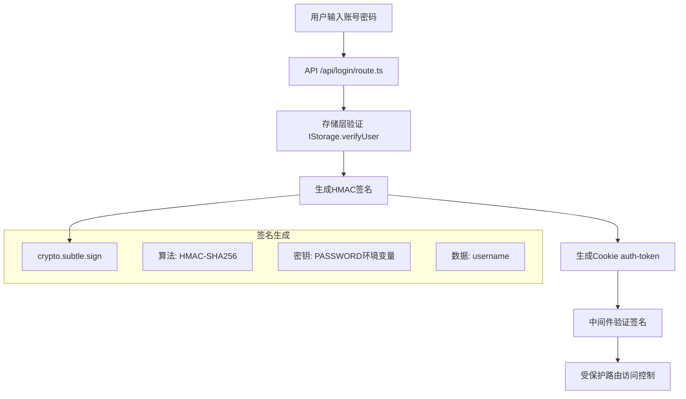
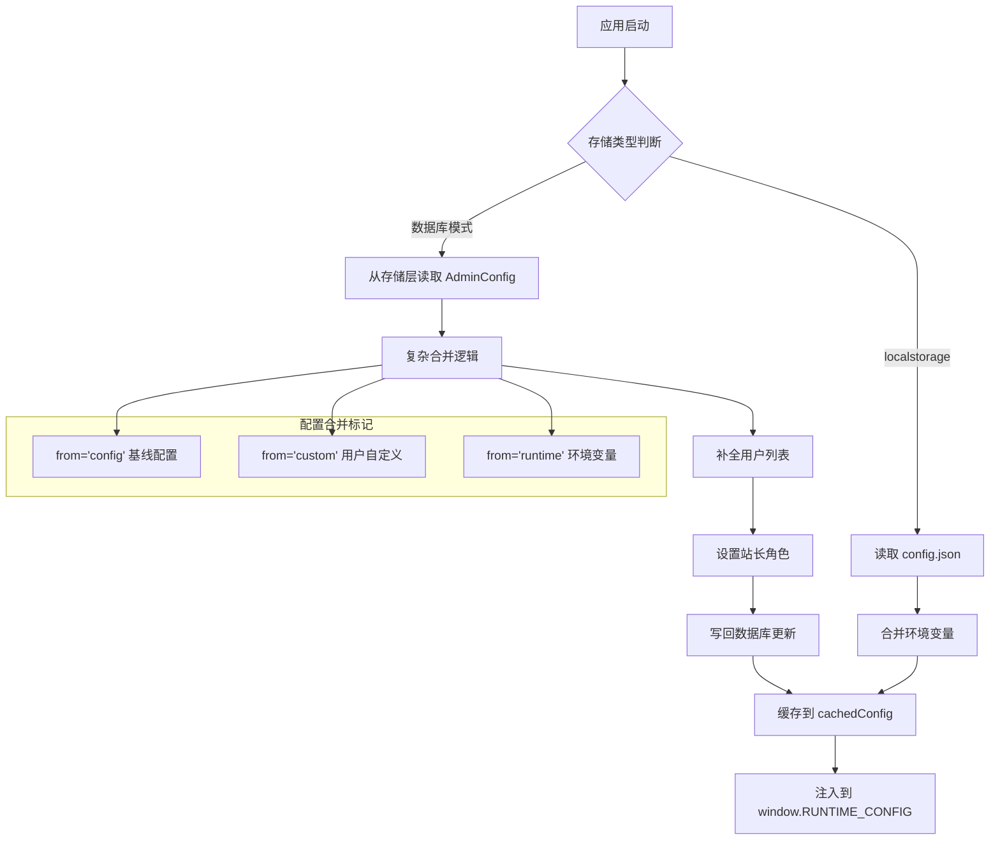

# MoonTV 综合技术架构指南 (v3.2.0-fixed)

**最后更新**: 2025-10-06  
**维护专家**: 系统架构师 + 技术文档专家  
**适用版本**: v3.2.0-fixed 及以上  
**文档类型**: 综合架构指南

## 📋 概述

本文档整合了 MoonTV 项目的完整技术架构体系，包括系统设计、核心模块解析、知识管理体系和文档管理最佳实践。基于 v3.2.0-fixed 版本的架构演进，提供全面的技术架构指南和知识管理框架。

## 🏗️ 系统架构总览

### 架构设计原则

```yaml
核心设计原则:
  1. 模块化设计: 松耦合、高内聚的组件化架构
  2. 可扩展性: 支持水平扩展和功能插件化
  3. 高可用性: 容错设计和故障快速恢复
  4. 安全优先: 多层安全防护和权限控制
  5. 性能优化: 缓存策略和资源优化

架构演进历程:
  v1.0 → v3.2.0: 基础功能完善
  v3.2.0-dev → v3.2.0-fixed: Docker+SSR问题修复
  未来规划: 微服务架构演进
```

### 技术栈概览

```yaml
前端技术栈:
  框架: Next.js 14 (App Router)
  语言: TypeScript 4.9+
  样式: Tailwind CSS 3.3+
  状态: React Context + Zustand
  UI: 自定义组件库
  动画: Framer Motion

后端技术栈:
  运行时: Node.js 18+
  API: Next.js API Routes
  认证: JWT + HMAC签名
  数据库: 多后端支持 (Redis/Upstash/D1/LocalStorage)
  缓存: 多层缓存策略

部署技术栈:
  容器化: Docker + Docker Compose
  反向代理: Nginx
  CI/CD: GitHub Actions
  监控: 自定义健康检查 + APM集成
```

## 🎯 系统架构层级设计

### L1: 前端展示层

```
React 18 + Next.js 14 App Router
├── 页面层 (src/app/*/page.tsx)
│   ├── 首页 (/) - 豆瓣推荐 + 自定义分类
│   ├── 搜索页 (/search) - 多源聚合搜索
│   ├── 播放页 (/play) - ArtPlayer视频播放
│   ├── 豆瓣页 (/douban) - 豆瓣分类浏览
│   ├── 登录页 (/login) - 用户认证
│   └── 管理后台 (/admin) - 配置管理（批量操作）
├── 组件层 (src/components/)
│   ├── 布局组件 (PageLayout, TopNav, MobileBottomNav)
│   ├── 业务组件 (VideoCard, EpisodeSelector, SourceSelector)
│   ├── 功能组件 (ThemeToggle, UserMenu, SearchSuggestions)
│   ├── 筛选组件 (FilterOptions - v3.2.0重构)
│   └── Provider组件 (ThemeProvider, SiteProvider, NavigationLoadingProvider)
└── 样式层
    ├── Tailwind CSS (原子化样式)
    ├── CSS变量 (主题系统)
    └── Framer Motion (动画)
```

### L2: API 服务层

```
Next.js API Routes (统一使用Node.js Runtime)
├── 用户认证 (/api/login, /api/register, /api/logout)
├── 搜索服务 (/api/search/*)
│   ├── /api/search - 多源搜索
│   ├── /api/search/one - 单源搜索
│   ├── /api/search/resources - 资源列表
│   ├── /api/search/suggestions - 搜索建议（v3.2.0优化）
│   └── /api/search/ws - WebSocket流式搜索
├── 详情服务 (/api/detail) - 视频详情
├── 豆瓣服务 (/api/douban/*)
│   ├── /api/douban/categories - 豆瓣分类
│   └── /api/douban/recommends - 豆瓣推荐
├── 配置服务 (/api/config/*)
│   ├── /api/config/sources - 资源站列表（v3.2.0简化）
│   └── /api/config/custom_category - 自定义分类
├── 用户数据 (/api/favorites, /api/playrecords, /api/searchhistory)
├── 管理员API (/api/admin/*)
│   ├── /api/admin/category - 分类管理
│   ├── /api/admin/source - 资源站管理（批量操作）
│   ├── /api/admin/config - 配置管理
│   ├── /api/admin/user - 用户管理
│   └── /api/admin/tvbox - TVBox配置
└── 系统服务 (/api/health, /api/tvbox/config)
```

### L3: 业务逻辑层

```
Core Libraries (src/lib/)
├── 认证模块 (auth.ts)
│   ├── JWT Token生成/验证
│   ├── HMAC签名（数据库模式）
│   ├── 会话管理
│   └── 权限检查
├── 配置管理 (config.ts, config.client.ts)
│   ├── 静态配置加载 (config.json)
│   ├── 动态配置管理 (非localstorage模式)
│   ├── 配置合并逻辑（复杂）
│   └── 环境变量处理
├── 数据库抽象层 (db.ts, db.client.ts)
│   ├── IStorage接口定义
│   ├── DbManager封装类
│   ├── 存储实现路由
│   └── 客户端存储抽象
├── 搜索引擎 (fetchVideoDetail.ts, downstream.ts)
│   ├── 多源并行搜索
│   ├── 流式结果返回
│   ├── 结果聚合排序
│   └── 超时控制
├── 豆瓣集成 (douban.ts, douban.client.ts)
│   ├── 豆瓣API代理
│   ├── 图片代理
│   └── 分类数据管理
├── 内容过滤 (yellow.ts)
│   └── 色情内容过滤
├── 版本管理 (version.ts, changelog.ts)
│   ├── 版本信息
│   └── 变更日志
└── 运行时配置 (runtime.ts - 自动生成)
    └── config.json编译时注入
```

### L4: 数据持久层

```
Storage Implementations
├── LocalStorage (浏览器端)
│   ├── 用户数据本地存储
│   ├── 无服务端依赖
│   └── 单设备使用
├── Redis (src/lib/redis.db.ts)
│   ├── 原生Redis客户端
│   ├── Docker部署专用
│   └── 高性能读写
├── Upstash Redis (src/lib/upstash.db.ts)
│   ├── HTTP-based Redis
│   ├── Serverless友好
│   └── 全球分布
└── Cloudflare D1 (src/lib/d1.db.ts)
    ├── SQLite-based
    ├── Cloudflare Pages专用
    └── SQL查询支持
```

## 🔄 数据流架构设计

### 搜索数据流架构



### 流式搜索架构



### 播放流程架构



### 用户认证流程架构

#### localstorage 模式认证

```mermaid
graph TB
    A[用户输入密码] --> B[API /api/login/route.ts]
    B --> C[验证 PASSWORD 环境变量]
    C --> D[生成Cookie auth-token]
    D --> E[中间件验证密码]
    E --> F[受保护路由访问]

    subgraph "Cookie结构"
        G[auth-token: { password: "..." }]
        H[httpOnly: true]
        I[secure: true 生产]
        J[sameSite: 'lax']
        K[maxAge: 7天]
    end

    D --> G
```

#### 数据库模式认证



### 配置加载流程架构



## 🔐 安全架构体系

### 认证机制架构

```yaml
localstorage模式:
  Cookie结构:
    auth-token: { password: '...' }
    httpOnly: true
    secure: true (生产)
    sameSite: 'lax'
    maxAge: 7天
  中间件验证: authInfo.password === process.env.PASSWORD

数据库模式:
  Cookie结构:
    auth-token: { username: '...', signature: '...' }
    httpOnly: true
    secure: true (生产)
    sameSite: 'lax'
    maxAge: 7天
  签名生成:
    使用: crypto.subtle.sign
    算法: HMAC-SHA256
    密钥: PASSWORD环境变量
    数据: username
  签名验证:
    使用: crypto.subtle.verify
    算法: HMAC-SHA256
    密钥: PASSWORD环境变量
    数据: username
```

### 权限层级架构

```yaml
角色系统:
  owner (USERNAME环境变量指定):
    - 所有管理员权限
    - 设置其他管理员
    - 删除用户
    - AdminConfig中role='owner'

  admin (由站长指定):
    - 配置管理
    - 资源站管理（批量操作）
    - 分类管理
    - 查看用户列表
    - AdminConfig中role='admin'

  user (普通用户):
    - 搜索视频
    - 播放视频
    - 收藏管理
    - 播放记录
    - AdminConfig中role='user'
```

### 中间件保护架构

```typescript
// 受保护路由匹配器
matcher: [
  '/((?!_next/static|_next/image|favicon.ico|login|warning|api/login|api/register|api/logout|api/cron|api/server-config|api/tvbox/config|api/tvbox/categories|api/douban/recommends|api/admin/tvbox).*)'
]

// 跳过认证路径
- /_next/* - Next.js内部资源
- /favicon.ico, /robots.txt, /manifest.json
- /icons/*, /logo.png
- /login, /warning - 公开页面
- /api/login, /api/register, /api/logout - 认证API
- /api/tvbox/config - TVBox公开接口（密码保护）

// 需要登录
- /admin/* - 管理后台
- /api/admin/* - 管理API
- /api/favorites, /api/playrecords, /api/searchhistory

// 认证失败处理
- API路由 → 401 Unauthorized
- 页面路由 → 重定向到 /login?redirect=...
```

## 🎨 UI 架构设计系统

### 响应式架构策略

```yaml
断点系统 (Tailwind默认):
  sm: 640px - 小屏手机
  md: 768px - 平板
  lg: 1024px - 桌面
  xl: 1280px - 大桌面
  2xl: 1536px - 超大屏

布局切换架构:
  < lg: 移动布局:
    - MobileHeader (顶部)
    - 内容区域
    - MobileBottomNav (底部导航)

  >= lg: 桌面布局:
    - TopNav (顶部导航)
    - 侧边栏 (可选)
    - 内容区域
```

### 主题系统架构

```typescript
// CSS变量驱动架构
const themeVariables = {
  // 明亮模式
  light: {
    '--background': 'white',
    '--foreground': 'gray-900',
    '--primary': 'blue-600',
  },
  // 暗黑模式
  dark: {
    '--background': 'black',
    '--foreground': 'gray-200',
    '--primary': 'blue-500',
  }
};

// 切换机制
- ThemeProvider (next-themes)
- ThemeToggle组件
- localStorage持久化
- 系统偏好检测
- 简化切换逻辑 (v3.2.0优化)
```

### 动画系统架构

```yaml
Framer Motion:
  - 页面切换动画
  - 列表项淡入
  - 模态框弹出
  - 骨架屏加载

CSS Transitions:
  - 主题切换 (disableTransitionOnChange: true)
  - Hover效果
  - Loading状态

Loading优化 (v3.2.0):
  - NavigationLoadingIndicator
  - 加载动画优化
  - 骨架屏改进
```

## 📦 构建与部署架构

### 构建流程架构

```yaml
开发模式 (pnpm dev): 1. gen:manifest - 生成PWA manifest.json
  2. gen:runtime - 生成src/lib/runtime.ts
  3. next dev -H 0.0.0.0 - 启动开发服务器

生产构建 (pnpm build): 1. gen:manifest - 生成PWA manifest.json
  2. gen:runtime - 生成src/lib/runtime.ts
  3. next build - Next.js构建
  - standalone输出
  - Edge Runtime优化
  - PWA资源生成
  4. 输出.next/目录

运行时配置生成:
  - scripts/generate-runtime.js
  - 读取 config.json
  - 生成 src/lib/runtime.ts
  - export default { api_site, custom_category }
```

### Docker 部署架构

```yaml
Dockerfile架构:
  基础镜像: node:18-alpine
  工作目录: /app
  依赖安装: pnpm install
  构建: pnpm build
  生产依赖: pnpm install --prod
  环境变量: DOCKER_ENV=true
  暴露端口: 3000
  启动: node start.js

数据持久化架构:
  localstorage模式: 无需卷挂载
  Redis模式: 外部Redis连接
  配置文件: 挂载 config.json (可选)

动态配置加载 (DOCKER_ENV=true):
  - 运行时读取 config.json
  - 支持热更新配置
  - 无需重新构建镜像
```

### Serverless 部署架构

```yaml
Vercel/Netlify:
  - 自动检测Next.js项目
  - 环境变量配置
  - Edge Runtime部署
  - 全球CDN分发
  - 自动HTTPS

Cloudflare Pages:
  - 构建命令: pnpm run pages:build
  - 输出目录: .vercel/output/static
  - 兼容性标志: nodejs_compat
  - D1数据库绑定: process.env.DB
  - 环境变量配置: 密钥形式
  - 边缘函数部署
```

## 🔌 第三方集成架构

### 豆瓣数据集成架构

```yaml
代理模式配置: direct - 服务端直连豆瓣
  cors-proxy-zwei - 浏览器通过CORS代理
  cmliussss-cdn-tencent - 腾讯云CDN
  cmliussss-cdn-ali - 阿里云CDN
  custom - 自定义代理URL

图片代理模式: direct - 浏览器直连豆瓣图片域名
  server - 服务端代理 (/api/image-proxy)
  img3 - 豆瓣官方CDN（阿里云）
  cmliussss-cdn-* - CMLiussss CDN
  custom - 自定义代理

配置注入架构:
  - 环境变量配置
  - AdminConfig存储
  - window.RUNTIME_CONFIG注入
  - 客户端动态读取
```

### TVBox 对接架构

```yaml
接口路径: /api/tvbox/config?pwd=密码
  1. 密码验证
  2. 读取配置 (AdminConfig.TvboxConfig)
  3. 生成TVBox格式配置JSON
  - 资源站点列表
  - 直播源配置
  - 播放器设置
  4. 返回配置

安全措施架构:
  - 密码保护 (必需)
  - 可禁用接口 (AdminConfig.SiteConfig.TVBoxEnabled)
  - 独立密码管理 (AdminConfig.SiteConfig.TVBoxPassword)
  - localstorage模式使用PASSWORD环境变量

配置管理架构 (v3.2.0):
  - 管理后台配置界面
  - 随机密码生成
  - 开关控制
  - 接口地址自动生成
```

### OrionTV/Selene 集成架构

```yaml
后端API兼容: 搜索接口 (/api/search)
  详情接口 (/api/detail)
  收藏接口 (/api/favorites)
  播放记录 (/api/playrecords)
  用户认证 (/api/login)

客户端要求:
  - HTTP请求标准化
  - Token认证支持 (Cookie)
  - JSON数据格式
```

## 📊 知识管理体系架构

### 知识体系分类结构

```
MoonTV知识体系 (v3.2.0-fixed)
├── 📊 项目概览层
│   ├── 项目基础信息
│   ├── 技术栈概览
│   ├── 版本历程记录
│   └── 里程碑成就
│
├── 🏗️ 技术架构层
│   ├── 系统架构设计
│   ├── 核心模块解析
│   ├── 数据流设计
│   └── 安全架构体系
│
├── 🚀 部署运维层
│   ├── Docker容器化方案
│   ├── 多平台部署策略
│   ├── 监控运维体系
│   └── 安全加固措施
│
├── 🧪 质量保证层
│   ├── 测试策略体系
│   ├── 质量门禁配置
│   ├── 安全测试框架
│   └── 持续质量改进
│
├── 📚 文档管理层
│   ├── 技术文档体系
│   ├── 知识管理最佳实践
│   ├── 文档自动化工具
│   └── 多语言支持策略
│
└── ⚡ 性能优化层
    ├── 前端性能优化
    ├── 后端性能调优
    ├── 监控分析系统
    └── 性能基准测试
```

### 文档架构体系

```yaml
文档分类结构:
  1. 项目概览文档:
    - README.md - 项目介绍和快速开始
    - CONTRIBUTING.md - 贡献指南
    - CHANGELOG.md - 版本变更记录
    - LICENSE - 开源协议

  2. 技术架构文档:
    - ARCHITECTURE.md - 系统架构设计
    - API_REFERENCE.md - API接口文档
    - DATABASE_SCHEMA.md - 数据库设计
    - SECURITY_GUIDE.md - 安全架构指南

  3. 开发指南文档:
    - DEVELOPMENT_SETUP.md - 开发环境配置
    - CODING_STANDARDS.md - 编码规范
    - TESTING_GUIDE.md - 测试指南
    - DEBUG_GUIDE.md - 调试指南

  4. 部署运维文档:
    - DEPLOYMENT_GUIDE.md - 部署指南
    - DOCKER_GUIDE.md - Docker部署详解
    - MONITORING.md - 监控配置
    - TROUBLESHOOTING.md - 故障排除

  5. 用户指南文档:
    - USER_MANUAL.md - 用户使用手册
    - ADMIN_GUIDE.md - 管理员指南
    - FAQ.md - 常见问题解答

  6. 项目管理文档:
    - PROJECT_ROADMAP.md - 项目路线图
    - RELEASE_NOTES/ - 发布说明目录
    - MEETING_MINUTES/ - 会议记录目录
```

### 知识管理最佳实践

```yaml
文档生命周期管理:
  创建: 需求分析 → 大纲设计 → 内容撰写
  审查: 技术审查 → 语言润色 → 准确性验证
  发布: 部署文档平台 → 更新索引 → 通知团队
  维护: 定期审查 → 用户反馈 → 持续优化

质量标准:
  准确性: 技术信息必须准确无误
  完整性: 覆盖所有必要知识点
  清晰性: 表达清晰，易于理解
  实用性: 提供实际可用的指导
  时效性: 及时更新，保持最新状态

更新机制:
  触发条件: 版本发布、架构变更、问题解决、用户反馈
  更新流程: 识别变更 → 分析影响 → 更新内容 → 验证质量 → 发布通知
  质量保证: 专家审查、用户验证、定期审计、反馈循环
```

## 📈 性能优化架构

### 前端性能优化架构

```yaml
代码优化策略:
  - 代码分割: 路由级和组件级懒加载
  - Tree Shaking: 移除未使用的代码
  - 压缩优化: Gzip/Brotli压缩
  - 包分析: webpack-bundle-analyzer分析

资源优化策略:
  - 图片优化: WebP格式、响应式图片
  - 字体优化: Web字体预加载
  - 缓存策略: 浏览器缓存和Service Worker
  - CDN加速: 静态资源CDN分发

渲染优化策略:
  - React优化: memo、useMemo、useCallback
  - 虚拟化: 长列表虚拟滚动
  - 懒加载: 图片和组件懒加载
  - 预加载: 关键资源预加载

v3.2.0性能改进:
  - 明暗模式切换简化
  - 加载动画优化
  - FilterOptions组件重构
  - API路由简化
```

### 后端性能调优架构

```yaml
API优化策略:
  - 缓存策略: Redis多层缓存
  - 并发处理: Promise.allSettled并行请求
  - 响应压缩: Gzip/Brotli响应压缩
  - 连接池: 数据库连接池优化

数据库优化策略:
  - 索引优化: 查询性能索引优化
  - 查询优化: SQL查询性能调优
  - 连接管理: 连接池配置优化
  - 缓存层: 查询结果缓存

部署优化策略:
  - 容器优化: 多阶段构建、镜像优化
  - 负载均衡: Nginx负载均衡配置
  - 网络优化: HTTP/2、Keep-Alive
  - 资源限制: CPU、内存限制配置
```

### 监控分析系统架构

```yaml
实时监控架构:
  性能指标: FCP、LCP、FID、CLS
  服务器指标: CPU、内存、磁盘、网络
  应用指标: 响应时间、吞吐量、错误率
  业务指标: 用户行为、功能使用情况

告警机制架构:
  阈值告警: 性能指标阈值监控
  异常告警: 错误和异常自动告警
  趋势告警: 性能趋势变化告警
  通知渠道: 邮件、短信、即时通讯

性能分析架构:
  性能报告: 定期性能分析报告
  瓶颈识别: 性能瓶颈自动识别
  优化建议: 基于分析的优化建议
  历史对比: 性能历史数据对比分析
```

## 🧩 扩展性设计架构

### 插件化架构要点

```yaml
资源站点插件化:
  - 配置驱动 (config.json)
  - 统一接口 (苹果CMS V10)
  - 热更新支持 (Docker模式)
  - from标记 (config/custom)
  - disabled开关
  - 批量操作 (v3.2.0新增)

存储后端插件化:
  - IStorage接口
  - 环境变量切换
  - 实现独立
  - DbManager封装
  - 易于扩展新后端

主题系统可扩展:
  - CSS变量驱动
  - Tailwind配置
  - 组件主题支持
  - 自定义主题色

配置系统可扩展:
  - AdminConfig类型扩展
  - 配置合并逻辑
  - 环境变量回退
  - 管理界面自动适配
```

### v3.2.0 架构改进

```yaml
批量操作架构:
  - 资源站点批量启用/禁用
  - 分类批量管理
  - UI组件重构支持
  - API批量更新支持

代码简化:
  - API路由优化
  - 组件逻辑重构
  - 类型安全增强
  - 错误处理改进

架构优化:
  - 统一运行时配置 (nodejs)
  - 简化认证流程
  - 优化缓存策略
  - 改进错误处理
```

## 🔄 持续改进机制

### 版本管理策略

```yaml
语义化版本:
  主版本: 重大功能变更、架构调整
  次版本: 新功能添加、性能优化
  修订版本: Bug修复、安全更新

发布流程:
  开发: feature分支开发
  测试: develop分支集成测试
  预发布: release分支发布准备
  生产: main分支生产部署

回滚策略:
  快速回滚: Docker镜像快速回滚
  蓝绿部署: 零停机时间部署
  灰度发布: 渐进式功能发布
  版本锁定: 生产环境版本锁定
```

### 知识更新机制

```yaml
触发条件:
  - 版本发布: 代码版本发布时更新文档
  - 架构变更: 系统架构调整时更新知识
  - 问题解决: 重大问题解决后更新最佳实践
  - 用户反馈: 基于用户反馈持续改进

更新流程:
  - 识别变更: 自动或手动识别变更需求
  - 分析影响: 评估变更对知识体系的影响
  - 更新内容: 同步更新相关文档和知识
  - 验证质量: 确保更新内容的准确性
  - 发布通知: 通知团队知识体系更新

质量保证:
  - 专家审查: 各领域专家审查更新内容
  - 用户验证: 实际用户验证文档实用性
  - 定期审计: 定期审计知识体系完整性
  - 反馈循环: 建立用户反馈收集机制
```

## 🎯 成功指标与目标

### 技术指标

```yaml
性能指标:
  页面加载时间: <1.5s (当前: ~1s)
  API响应时间: <50ms (当前: ~100ms)
  系统可用性: 99.9%+
  错误率: <0.05%

质量指标:
  代码覆盖率: >90%
  安全漏洞: 0个已知漏洞
  构建成功率: 100%
  测试通过率: 100%

效率指标:
  部署时间: <5分钟
  故障恢复时间: <30秒
  开发效率: 提升30%
  运维效率: 提升50%
```

### 业务指标

```yaml
用户体验:
  页面跳出率: <20%
  用户满意度: >4.5/5.0
  功能使用率: >80%
  用户留存率: >60%

开发效率:
  新功能开发: 周期缩短50%
  Bug修复时间: 平均<4小时
  代码审查效率: 提升40%
  知识查找效率: 提升60%
```

## 📞 专家团队与协作机制

### 核心专家团队

```yaml
系统架构专家:
  职责: 整体架构设计、技术决策、知识体系协调
  专长: 系统设计、技术选型、性能优化
  协调领域: 全局技术架构、跨领域技术整合

DevOps架构专家:
  职责: 部署策略、运维自动化、基础设施
  专长: Docker、CI/CD、监控运维
  协调领域: 生产部署、运维监控、安全加固

质量工程师:
  职责: 质量保证、测试策略、持续集成
  专长: 自动化测试、质量门禁、性能测试
  协调领域: 测试体系、代码质量、安全测试

技术文档专家:
  职责: 文档体系、知识管理、开发指南
  专长: 技术写作、知识组织、文档自动化
  协调领域: 文档标准、知识管理、开发体验

性能工程师:
  职责: 性能优化、监控分析、基准测试
  专长: 前端优化、后端调优、性能监控
  协调领域: 性能架构、监控体系、优化策略
```

### 协作机制

```yaml
定期会议:
  - 架构评审: 重大架构变更评审会议
  - 技术分享: 定期技术最佳实践分享
  - 问题讨论: 技术难题集体讨论解决
  - 知识同步: 跨领域知识同步会议

协作工具:
  - 知识库: 统一的技术知识管理平台
  - 文档协作: 实时文档编辑和评论
  - 项目管理: 任务跟踪和进度管理
  - 通讯工具: 即时通讯和视频会议

决策流程:
  - 技术决策: 基于数据和技术评估
  - 变更管理: 标准化的变更管理流程
  - 风险评估: 技术风险评估和缓解措施
  - 效果评估: 变更效果量化评估
```

## 🚀 未来发展规划

### 短期目标 (3 个月)

```yaml
性能优化:
  - 前端性能提升至行业领先水平
  - API响应时间优化到50ms以内
  - 缓存命中率提升到95%+
  - 内存使用优化到256MB以内

功能完善:
  - 智能搜索算法优化
  - 用户体验界面改进
  - 移动端性能优化
  - 管理后台功能增强

质量提升:
  - 测试覆盖率提升到90%+
  - 安全防护体系完善
  - 监控告警系统优化
  - 文档体系完整性提升
```

### 中期目标 (6 个月)

```yaml
架构演进:
  - 微服务架构演进实施
  - 数据库架构优化升级
  - 缓存体系架构改进
  - 负载均衡策略优化

技术升级:
  - Next.js版本升级到最新
  - TypeScript类型系统完善
  - 构建工具链现代化
  - 开发工具链升级

生态建设:
  - 开源社区建设
  - 插件生态系统构建
  - 第三方集成丰富
  - 开发者工具完善
```

### 长期目标 (12 个月)

```yaml
技术领先:
  - AI技术集成应用
  - 云原生架构转型
  - 边缘计算技术探索
  - 新兴技术预研集成

平台化发展:
  - 多租户架构支持
  - 企业级功能完善
  - 商业化功能开发
  - 国际化支持完善

生态繁荣:
  - 开发者生态建设
  - 合作伙伴生态扩展
  - 技术影响力提升
  - 行业标准制定参与
```

## 📋 使用指南与最佳实践

### 架构文档使用指南

1. **新团队成员**: 从系统架构概览开始，逐步学习各个技术模块
2. **开发人员**: 重点参考数据流设计、API 架构、安全架构
3. **运维人员**: 重点参考部署架构、监控体系、故障排除
4. **产品经理**: 重点参考功能架构、用户流程、业务指标
5. **技术负责人**: 全面掌握，重点关注架构决策和技术演进

### 知识体系使用指南

1. **架构决策**: 参考系统架构设计和技术栈选择
2. **开发指导**: 使用开发指南和最佳实践文档
3. **部署运维**: 遵循部署指南和监控配置
4. **问题排查**: 使用故障排除和诊断指南
5. **持续改进**: 参考性能优化和持续改进机制

### 最佳实践总结

```yaml
架构设计最佳实践:
  - 模块化设计，松耦合架构
  - 接口标准化，易于扩展
  - 性能优先，缓存优化
  - 安全第一，多层防护
  - 监控完善，及时响应

开发流程最佳实践:
  - 代码审查，质量保证
  - 自动化测试，持续集成
  - 文档同步，知识共享
  - 版本管理，规范发布
  - 团队协作，高效沟通

运维管理最佳实践:
  - 容器化部署，环境一致
  - 自动化运维，减少人工
  - 监控告警，及时响应
  - 备份恢复，数据安全
  - 性能优化，持续改进
```

---

**文档维护**: 系统架构师 + 技术文档专家  
**更新频率**: 重大架构变更时更新  
**版本**: v3.2.0-fixed  
**最后更新**: 2025-10-06  
**下次审查**: 2025-11-06 或重大架构变更时
