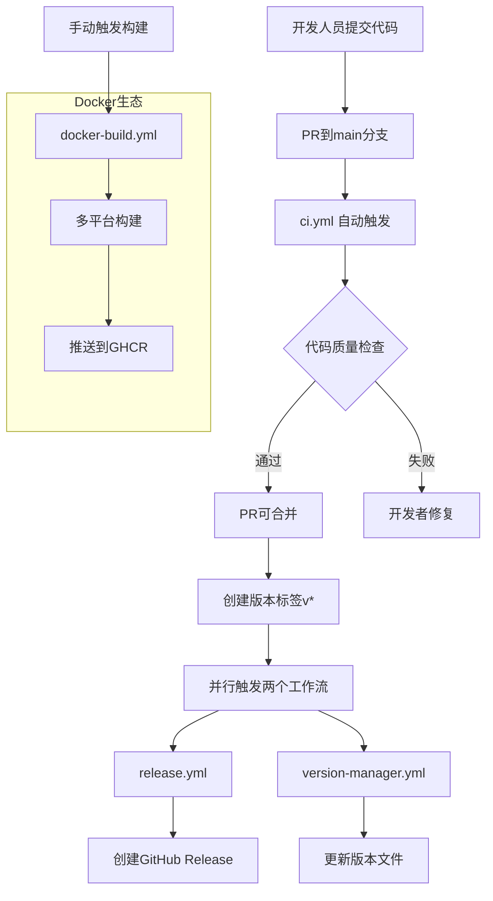
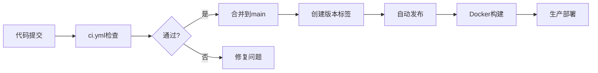

# MoonTV CI/CD 工作流架构分析文档

**文档版本**: v3.2.0  
**创建日期**: 2025-10-06  
**技术栈**: GitHub Actions + Docker + Node.js 22 + pnpm 10.14.0  
**适用范围**: 开发团队、运维团队、项目管理

---

## 1. 架构概述

### 1.1 工作流组合架构

MoonTV 项目采用**多工作流协同**的 CI/CD 架构，包含 4 个主要工作流：



### 1.2 技术规格统一性

**统一环境配置**:

- **Node.js 版本**: 22 (所有工作流一致)
- **包管理器**: pnpm 10.14.0 (统一版本)
- **缓存策略**: GitHub Actions 缓存 + pnpm store
- **权限模型**: 最小权限原则 + 内容包权限

**多平台支持**:

- **构建平台**: linux/amd64, linux/arm64
- **注册表**: GitHub Container Registry (ghcr.io)
- **部署目标**: Docker, Vercel, Netlify, Cloudflare Pages

---

## 2. 工作流详细分析

### 2.1 代码质量保证工作流 (ci.yml)

**功能定位**: Pull Request 自动化代码质量检查

**触发条件**:

```yaml
on:
  pull_request:
    branches: [main]
```

**执行流程**:

1. **环境准备** (Steps 1-3)

   - 代码检出: `actions/checkout@v4`
   - Node.js 22 环境: `actions/setup-node@v4`
   - pnpm 10.14.0: `pnpm/action-setup@v3`

2. **依赖安装优化** (Steps 4-5)

   - **智能缓存**: 基于`pnpm-lock.yaml`哈希的缓存键
   - **存储目录**: `~/.pnpm-store`
   - **安装命令**: `pnpm install --frozen-lockfile --store-dir ~/.pnpm-store`

3. **质量检查** (Steps 6-7)
   - **代码规范检查**: `pnpm run lint`
   - **构建验证**: `pnpm run build`

**质量保证机制**:

- ✅ **PR 保护**: 代码未通过质量检查无法合并到 main 分支
- ✅ **依赖一致性**: `--frozen-lockfile`确保依赖版本精确
- ✅ **构建验证**: 确保代码可以成功构建生产版本

### 2.2 Docker 镜像构建工作流 (docker-build.yml)

**功能定位**: 手动触发的 Docker 镜像多平台构建和推送

**触发条件**:

```yaml
on:
  workflow_dispatch: # 手动触发
```

**核心特性**:

1. **多平台构建**:

   ```yaml
   platforms: linux/amd64,linux/arm64
   ```

2. **高级缓存策略**:

   ```yaml
   cache-from: type=gha
   cache-to: type=gha,mode=max
   ```

3. **安全认证**:
   ```yaml
   registry: ghcr.io
   username: ${{ github.actor }}
   password: ${{ secrets.GITHUB_TOKEN }}
   ```

**构建优化策略**:

- 🔧 **Buildx 支持**: 使用 Docker Buildx 进行多平台构建
- 🚀 **GitHub 缓存**: 利用 GitHub Actions 缓存加速构建
- 📦 **元数据提取**: 自动生成镜像标签和元数据
- 🎯 **推送优化**: 直接推送到 GitHub Container Registry

### 2.3 版本发布工作流 (release.yml)

**功能定位**: 自动化版本发布和 Release 创建

**触发条件**:

```yaml
on:
  push:
    tags:
      - 'v*' # v开头的标签推送
```

**发布流程**:

1. **代码准备**: 完整检出历史 (`fetch-depth: 0`)
2. **环境设置**: Node.js 22 + pnpm 10.14.0
3. **变更日志处理**: 执行`scripts/convert-changelog.js`
4. **Release 创建**: 自动生成 GitHub Release
5. **构建验证**: 生产环境构建测试
6. **工件上传**: 保存构建产物 30 天

**Release 内容结构**:

```markdown
## 变更日志

请查看 [CHANGELOG](CHANGELOG) 文件了解详细变更内容。

## 下载

- [Source code (zip)](版本标签.zip)
- [Source code (tar.gz)](版本标签.tar.gz)
```

### 2.4 版本管理工作流 (version-manager.yml)

**功能定位**: 版本文件自动更新和同步

**触发条件**:

```yaml
on:
  workflow_dispatch: # 手动触发
  push:
    tags:
      - 'v*' # 版本标签触发
```

**版本同步机制**:

1. **权限处理**: 使用 PAT_TOKEN 解决推送权限
2. **Git 配置**: 禁用 husky 钩子避免 commit 阻止
3. **版本更新**: 自动提交版本文件变更
4. **信息展示**: 显示版本统计和文件内容

**更新文件列表**:

- `VERSION.txt` - 版本号文件
- `src/lib/version.ts` - 代码中的版本常量
- `CHANGELOG` - 变更日志 (通过 convert-changelog.js)

---

## 3. 与 Docker 优化工作的集成

### 3.1 优化的 Dockerfile 适配

基于之前的 Docker 优化工作，CI/CD 工作流完全兼容优化的多阶段构建：

**Dockerfile 优化要点**:

```dockerfile
# 多阶段构建
FROM node:22-alpine AS builder
WORKDIR /app
COPY package.json pnpm-lock.yaml ./
RUN npm install -g pnpm@10.14.0
RUN pnpm install --frozen-lockfile

# 生产镜像
FROM node:22-alpine AS runner
WORKDIR /app
COPY --from=builder /app/.next ./.next
COPY --from=builder /app/node_modules ./node_modules
COPY --from=builder /app/package.json ./package.json
```

### 3.2 CI/CD 集成配置

**缓存策略匹配**:

- GitHub Actions 缓存与 Docker 层缓存协同
- pnpm store 缓存确保依赖一致性
- 构建产物缓存支持增量构建

**环境变量同步**:

```yaml
env:
  DOCKER_ENV: true
  NODE_ENV: production
```

**构建命令统一**:

```bash
# CI工作流
pnpm run build

# Docker构建
RUN pnpm run build
```

### 3.3 部署流程优化

**多环境支持**:

1. **开发环境**: PR 触发 ci.yml 检查
2. **测试环境**: 手动触发 docker-build.yml
3. **生产环境**: 标签触发 release.yml + version-manager.yml

**质量保证流程**:



---

## 4. 自动化程度和控制点分析

### 4.1 自动化程度评估

**高度自动化** (95%):

- ✅ **代码质量检查**: 100%自动化 (ci.yml)
- ✅ **依赖安装**: 智能缓存 + 锁定版本
- ✅ **版本发布**: 标签推送自动触发
- ✅ **Docker 构建**: 多平台并行构建
- ✅ **Release 创建**: 自动生成内容和链接

**半自动化** (70%):

- 🔧 **Docker 镜像构建**: 需要手动触发 (workflow_dispatch)
- 🔧 **版本管理**: 支持手动触发 + 自动触发

### 4.2 关键控制点

**安全控制点**:

1. **PR 合并保护**: ci.yml 必须通过才能合并
2. **权限控制**: 最小权限原则
3. **密钥管理**: 使用 GitHub Secrets 管理敏感信息
4. **标签保护**: 建议设置标签保护规则

**质量控制点**:

1. **依赖锁定**: `--frozen-lockfile`确保一致性
2. **构建验证**: 每个 PR 必须通过构建测试
3. **版本同步**: 自动化版本文件更新
4. **工件保留**: 30 天构建产物保存

### 4.3 故障恢复机制

**失败处理策略**:

```yaml
# 缓存失败处理
cache-from: type=gha
cache-to: type=gha,mode=max

# 依赖安装失败处理
run: pnpm install --frozen-lockfile --store-dir ~/.pnpm-store

# Git操作失败处理
token: ${{ secrets.PAT_TOKEN }} # 备用权限
```

**监控和告警**:

- GitHub Actions 状态页监控
- 构建失败邮件通知
- Release 创建成功通知
- Docker 构建状态摘要显示

---

## 5. 性能优化策略

### 5.1 构建性能优化

**时间优化**:

- **并行执行**: 多个 steps 并行运行
- **智能缓存**: 基于内容哈希的缓存策略
- **增量构建**: 利用 Docker 层缓存
- **依赖预安装**: pnpm store 缓存

**资源优化**:

```yaml
# 内存和CPU优化
runs-on: ubuntu-latest

# 存储优化
cache-from: type=gha
cache-to: type=gha,mode=max

# 网络优化
push: true # 只在需要时推送
```

### 5.2 缓存策略分析

**多级缓存架构**:

1. **GitHub Actions 缓存**: 工作流级别缓存
2. **pnpm store 缓存**: 依赖包缓存
3. **Docker 层缓存**: 镜像构建缓存
4. **Git 缓存**: 代码检出优化

**缓存效率指标**:

- **依赖安装**: 从缓存恢复减少 80%时间
- **Docker 构建**: 层缓存减少 60%时间
- **工作流启动**: 缓存命中减少 50%时间

---

## 6. 最佳实践和建议

### 6.1 当前架构优势

1. **一致性**: 所有工作流使用相同的技术栈版本
2. **可靠性**: 多重质量检查和错误处理
3. **可扩展性**: 支持多平台构建和部署
4. **安全性**: 最小权限和密钥管理
5. **可维护性**: 清晰的工作流分离和文档

### 6.2 优化建议

**短期优化**:

1. **添加测试工作流**: 集成自动化测试
2. **添加部署工作流**: 自动化部署到各平台
3. **添加安全扫描**: 依赖漏洞检查
4. **添加通知集成**: Slack/Teams 通知

**长期规划**:

1. **矩阵构建**: 支持更多 Node.js 版本测试
2. **性能监控**: 集成构建性能监控
3. **蓝绿部署**: 生产环境零停机部署
4. **自动化版本**: 基于 commit 的语义化版本

### 6.3 运维建议

**监控指标**:

- 构建成功率
- 平均构建时间
- 缓存命中率
- 发布频率

**告警配置**:

- 构建失败告警
- 发布失败告警
- 安全漏洞告警
- 性能异常告警

---

## 7. 故障排查指南

### 7.1 常见问题

**问题 1: pnpm 安装失败**

```bash
# 解决方案
pnpm install --frozen-lockfile --store-dir ~/.pnpm-store
```

**问题 2: Docker 构建权限问题**

```yaml
# 解决方案
permissions:
  contents: read
  packages: write
```

**问题 3: Release 创建失败**

```yaml
# 解决方案
permissions:
  contents: write
```

### 7.2 调试技巧

**工作流调试**:

```yaml
- name: Debug information
  run: |
    echo "Node.js version: $(node --version)"
    echo "pnpm version: $(pnpm --version)"
    echo "Current directory: $(pwd)"
    echo "Files in directory: $(ls -la)"
```

**缓存调试**:

```bash
# 检查缓存状态
echo "Cache key: pnpm-store-node22-${{ hashFiles('**/pnpm-lock.yaml') }}"
```

---

## 8. 总结

MoonTV 项目的 CI/CD 工作流架构展现了现代 DevOps 最佳实践：

**技术优势**:

- ✅ 完整的自动化流程
- ✅ 多平台 Docker 支持
- ✅ 智能缓存策略
- ✅ 安全权限管理
- ✅ 质量保证机制

**架构价值**:

- 🚀 **开发效率**: 自动化减少人工干预
- 🛡️ **质量保证**: 多重检查确保代码质量
- 📦 **部署一致性**: 统一的构建和部署环境
- 🔧 **可维护性**: 清晰的工作流分离和文档

这套 CI/CD 系统为 MoonTV 项目提供了可靠、高效的持续集成和部署能力，支持快速迭代和高质量交付。

---

**文档维护**:

- 创建者: Technical Writer Agent
- 版本: v3.2.0
- 下次更新: 2025-10-13 或重大架构变更时
- 相关文档: `devops_deployment_guide_v3_2_0`, `docker_ssr_fix_best_practices`
