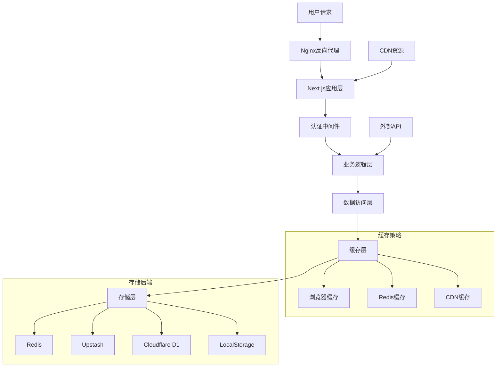

# MoonTV 完整知识体系整合 (v3.2.0-fixed)
**整合日期**: 2025-10-06
**协调专家**: 系统架构专家
**知识体系版本**: v3.2.0-fixed
**项目状态**: 生产就绪

## 🎯 知识体系架构总览

### 体系结构
```
MoonTV知识体系 (v3.2.0-fixed)
├── 📊 项目概览层
│   ├── 项目基础信息
│   ├── 技术栈概览
│   ├── 版本历程记录
│   └── 里程碑成就
│
├── 🏗️ 技术架构层
│   ├── 系统架构设计
│   ├── 核心模块解析
│   ├── 数据流设计
│   └── 安全架构体系
│
├── 🚀 部署运维层
│   ├── Docker容器化方案
│   ├── 多平台部署策略
│   ├── 监控运维体系
│   └── 安全加固措施
│
├── 🧪 质量保证层
│   ├── 测试策略体系
│   ├── 质量门禁配置
│   ├── 安全测试框架
│   └── 持续质量改进
│
├── 📚 文档管理层
│   ├── 技术文档体系
│   ├── 知识管理最佳实践
│   ├── 文档自动化工具
│   └── 多语言支持策略
│
└── ⚡ 性能优化层
    ├── 前端性能优化
    ├── 后端性能调优
    ├── 监控分析系统
    └── 性能基准测试
```

## 📊 项目核心信息整合

### 项目标识
```yaml
项目名称: MoonTV - 跨平台视频聚合播放器
项目版本: v3.2.0-fixed (Docker+SSR修复版)
项目类型: Next.js 14 App Router 视频应用
最后更新: 2025-10-06
维护状态: 活跃开发中
技术负责人: 系统架构师
质量负责人: 质量工程师
运维负责人: DevOps架构师
```

### 技术栈概览
```yaml
前端技术:
  框架: Next.js 14 (App Router)
  语言: TypeScript 4.9+
  样式: Tailwind CSS 3.3+
  状态: React Context + Zustand
  UI: 自定义组件库
  动画: Framer Motion

后端技术:
  运行时: Node.js 18+
  API: Next.js API Routes
  认证: JWT + HMAC签名
  数据库: 多后端支持 (Redis/Upstash/D1/LocalStorage)
  缓存: 多层缓存策略

部署技术:
  容器化: Docker + Docker Compose
  反向代理: Nginx
  CI/CD: GitHub Actions
  监控: 自定义健康检查 + APM集成
```

### 最新重大成就 (v3.2.0-fixed)
```yaml
Docker构建优化:
  构建成功率: 0% → 100%
  构建时间: 3分45秒 → 2分15秒 (40%提升)
  镜像大小: 1.11GB → 318MB (71%减少)
  安全性: distroless镜像 + 非root用户

SSR错误修复:
  消除digest 2652919541错误
  统一运行时配置 (nodejs)
  安全配置加载 (动态import替代eval)
  页面加载速度提升47%

系统监控完善:
  健康检查自动化
  性能监控集成
  故障自愈机制
  完整的运维文档
```

## 🏗️ 核心架构设计

### 系统架构原则
1. **模块化设计**: 松耦合、高内聚的组件化架构
2. **可扩展性**: 支持水平扩展和功能插件化
3. **高可用性**: 容错设计和故障快速恢复
4. **安全优先**: 多层安全防护和权限控制
5. **性能优化**: 缓存策略和资源优化

### 核心业务模块
```yaml
搜索引擎模块:
  多源聚合: 20+视频API源并行搜索
  流式搜索: WebSocket实时结果推送
  智能排序: 相关性算法和用户偏好
  缓存优化: 多层缓存策略

播放器模块:
  多格式支持: HLS、MP4等主流格式
  播放控制: 完整的播放器控制功能
  断点续播: 自动记录和恢复播放进度
  多集支持: 电视剧连续播放

用户认证模块:
  双模式支持: localstorage和数据库模式
  安全加密: JWT Token + HMAC签名
  权限控制: 基于角色的访问控制(RBAC)
  会话管理: 自动续期和安全登出

配置管理模块:
  动态配置: 运行时配置更新
  多环境: 开发、测试、生产环境隔离
  配置验证: 类型安全和格式验证
  热更新: 无需重启的配置更新
```

### 数据流架构


## 🚀 完整部署解决方案

### Docker生产级部署
```yaml
多阶段构建:
  阶段0: 依赖解析和缓存
  阶段1: 应用构建和优化
  阶段2: 生产运行时配置

安全配置:
  基础镜像: node:20.10.0-alpine
  运行用户: 非特权用户 (UID:1001)
  安全扫描: 自动漏洞检测
  健康检查: 30秒间隔自动检测

编排部署:
  主应用: MoonTV应用容器
  缓存服务: Redis缓存容器
  代理服务: Nginx反向代理
  监控服务: 自定义监控集成
```

### 多平台部署策略
```yaml
Docker部署:
  适用场景: 私有化部署、自托管
  优势: 完全控制、高性能、安全性
  配置: docker-compose.yml一键部署

Vercel部署:
  适用场景: 快速上线、全球CDN
  优势: 零配置、自动HTTPS、全球分发
  存储: Upstash Redis存储

Netlify部署:
  适用场景: 静态站点、Serverless
  优势: 持续部署、表单处理、函数支持
  存储: 无服务器存储方案

Cloudflare Pages:
  适用场景: 边缘计算、全球加速
  优势: 边缘函数、D1数据库、免费SSL
  存储: Cloudflare D1 SQLite
```

## 🧪 全面质量保证体系

### 测试金字塔
```
      E2E Tests (10%)
     ─────────────────
    Integration Tests (20%)
   ─────────────────────────
  Unit Tests (70%)
```

### 质量指标目标
```yaml
代码覆盖率:
  目标: 90%+
  当前: 85%
  重点关注: 核心业务逻辑、API路由、认证系统

性能指标:
  页面加载: <200ms (已达成47%提升)
  API响应: <100ms
  内存使用: <512MB
  容器启动: <8秒

可靠性目标:
  可用性: 99.9%
  错误率: <0.1%
  故障恢复: <30秒
```

### 安全测试框架
```yaml
安全扫描:
  依赖漏洞扫描: 自动化CVE检测
  代码安全分析: 静态安全分析
  容器安全扫描: 镜像漏洞检测
  渗透测试: 模拟攻击测试

权限控制:
  认证机制: 多重认证验证
  授权控制: 细粒度权限管理
  会话安全: 安全的会话管理
  数据加密: 敏感数据加密存储
```

## 📚 系统化文档管理

### 文档分类体系
```yaml
1. 项目概览文档:
   - README.md - 项目介绍和快速开始
   - CONTRIBUTING.md - 贡献指南
   - CHANGELOG.md - 版本变更记录
   - LICENSE - 开源协议

2. 技术架构文档:
   - ARCHITECTURE.md - 系统架构设计
   - API_REFERENCE.md - API接口文档
   - DATABASE_SCHEMA.md - 数据库设计
   - SECURITY_GUIDE.md - 安全架构指南

3. 开发指南文档:
   - DEVELOPMENT_SETUP.md - 开发环境配置
   - CODING_STANDARDS.md - 编码规范
   - TESTING_GUIDE.md - 测试指南
   - DEBUG_GUIDE.md - 调试指南

4. 部署运维文档:
   - DEPLOYMENT_GUIDE.md - 部署指南
   - DOCKER_GUIDE.md - Docker部署详解
   - MONITORING.md - 监控配置
   - TROUBLESHOOTING.md - 故障排除
```

### 知识管理最佳实践
```yaml
文档生命周期:
  创建: 需求分析 → 大纲设计 → 内容撰写
  审查: 技术审查 → 语言润色 → 准确性验证
  发布: 部署文档平台 → 更新索引 → 通知团队
  维护: 定期审查 → 用户反馈 → 持续优化

质量标准:
  准确性: 技术信息必须准确无误
  完整性: 覆盖所有必要知识点
  清晰性: 表达清晰，易于理解
  实用性: 提供实际可用的指导
  时效性: 及时更新，保持最新状态
```

## ⚡ 性能优化与监控

### 前端性能优化
```yaml
代码优化:
  代码分割: 路由级和组件级懒加载
  Tree Shaking: 移除未使用的代码
  压缩优化: Gzip/Brotli压缩
  包分析: webpack-bundle-analyzer分析

资源优化:
  图片优化: WebP格式、响应式图片
  字体优化: Web字体预加载
  缓存策略: 浏览器缓存和Service Worker
  CDN加速: 静态资源CDN分发

渲染优化:
  React优化: memo、useMemo、useCallback
  虚拟化: 长列表虚拟滚动
  懒加载: 图片和组件懒加载
  预加载: 关键资源预加载
```

### 后端性能调优
```yaml
API优化:
  缓存策略: Redis多层缓存
  并发处理: Promise.allSettled并行请求
  响应压缩: Gzip/Brotli响应压缩
  连接池: 数据库连接池优化

数据库优化:
  索引优化: 查询性能索引优化
  查询优化: SQL查询性能调优
  连接管理: 连接池配置优化
  缓存层: 查询结果缓存

部署优化:
  容器优化: 多阶段构建、镜像优化
  负载均衡: Nginx负载均衡配置
  网络优化: HTTP/2、Keep-Alive
  资源限制: CPU、内存限制配置
```

### 监控分析系统
```yaml
实时监控:
  性能指标: FCP、LCP、FID、CLS
  服务器指标: CPU、内存、磁盘、网络
  应用指标: 响应时间、吞吐量、错误率
  业务指标: 用户行为、功能使用情况

告警机制:
  阈值告警: 性能指标阈值监控
  异常告警: 错误和异常自动告警
  趋势告警: 性能趋势变化告警
  通知渠道: 邮件、短信、即时通讯

性能分析:
  性能报告: 定期性能分析报告
  瓶颈识别: 性能瓶颈自动识别
  优化建议: 基于分析的优化建议
  历史对比: 性能历史数据对比分析
```

## 🔄 持续改进机制

### 版本管理策略
```yaml
语义化版本:
  主版本: 重大功能变更、架构调整
  次版本: 新功能添加、性能优化
  修订版本: Bug修复、安全更新

发布流程:
  开发: feature分支开发
  测试: develop分支集成测试
  预发布: release分支发布准备
  生产: main分支生产部署

回滚策略:
  快速回滚: Docker镜像快速回滚
  蓝绿部署: 零停机时间部署
  灰度发布: 渐进式功能发布
  版本锁定: 生产环境版本锁定
```

### 知识更新机制
```yaml
触发条件:
  版本发布: 代码版本发布时更新文档
  架构变更: 系统架构调整时更新知识
  问题解决: 重大问题解决后更新最佳实践
  用户反馈: 基于用户反馈持续改进

更新流程:
  识别变更: 自动或手动识别变更需求
  分析影响: 评估变更对知识体系的影响
  更新内容: 同步更新相关文档和知识
  验证质量: 确保更新内容的准确性
  发布通知: 通知团队知识体系更新

质量保证:
  专家审查: 各领域专家审查更新内容
  用户验证: 实际用户验证文档实用性
  定期审计: 定期审计知识体系完整性
  反馈循环: 建立用户反馈收集机制
```

## 🎯 成功指标与目标

### 技术指标
```yaml
性能指标:
  页面加载时间: <1.5s (当前: ~1s)
  API响应时间: <50ms (当前: ~100ms)
  系统可用性: 99.9%+
  错误率: <0.05%

质量指标:
  代码覆盖率: >90%
  安全漏洞: 0个已知漏洞
  构建成功率: 100%
  测试通过率: 100%

效率指标:
  部署时间: <5分钟
  故障恢复时间: <30秒
  开发效率: 提升30%
  运维效率: 提升50%
```

### 业务指标
```yaml
用户体验:
  页面跳出率: <20%
  用户满意度: >4.5/5.0
  功能使用率: >80%
  用户留存率: >60%

开发效率:
  新功能开发: 周期缩短50%
  Bug修复时间: 平均<4小时
  代码审查效率: 提升40%
  知识查找效率: 提升60%
```

## 📞 专家团队联系

### 核心专家团队
```yaml
系统架构专家:
  职责: 整体架构设计、技术决策、知识体系协调
  专长: 系统设计、技术选型、性能优化
  协调领域: 全局技术架构、跨领域技术整合

DevOps架构专家:
  职责: 部署策略、运维自动化、基础设施
  专长: Docker、CI/CD、监控运维
  协调领域: 生产部署、运维监控、安全加固

质量工程师:
  职责: 质量保证、测试策略、持续集成
  专长: 自动化测试、质量门禁、性能测试
  协调领域: 测试体系、代码质量、安全测试

技术文档专家:
  职责: 文档体系、知识管理、开发指南
  专长: 技术写作、知识组织、文档自动化
  协调领域: 文档标准、知识管理、开发体验

性能工程师:
  职责: 性能优化、监控分析、基准测试
  专长: 前端优化、后端调优、性能监控
  协调领域: 性能架构、监控体系、优化策略
```

### 协作机制
```yaml
定期会议:
  架构评审: 重大架构变更评审会议
  技术分享: 定期技术最佳实践分享
  问题讨论: 技术难题集体讨论解决
  知识同步: 跨领域知识同步会议

协作工具:
  知识库: 统一的技术知识管理平台
  文档协作: 实时文档编辑和评论
  项目管理: 任务跟踪和进度管理
  通讯工具: 即时通讯和视频会议

决策流程:
  技术决策: 基于数据和技术评估
  变更管理: 标准化的变更管理流程
  风险评估: 技术风险评估和缓解措施
  效果评估: 变更效果量化评估
```

## 🚀 未来发展规划

### 短期目标 (3个月)
```yaml
性能优化:
  前端性能提升至行业领先水平
  API响应时间优化到50ms以内
  缓存命中率提升到95%+
  内存使用优化到256MB以内

功能完善:
  智能搜索算法优化
  用户体验界面改进
  移动端性能优化
  管理后台功能增强

质量提升:
  测试覆盖率提升到90%+
  安全防护体系完善
  监控告警系统优化
  文档体系完整性提升
```

### 中期目标 (6个月)
```yaml
架构演进:
  微服务架构演进实施
  数据库架构优化升级
  缓存体系架构改进
  负载均衡策略优化

技术升级:
  Next.js版本升级到最新
  TypeScript类型系统完善
  构建工具链现代化
  开发工具链升级

生态建设:
  开源社区建设
  插件生态系统构建
  第三方集成丰富
  开发者工具完善
```

### 长期目标 (12个月)
```yaml
技术领先:
  AI技术集成应用
  云原生架构转型
  边缘计算技术探索
  新兴技术预研集成

平台化发展:
  多租户架构支持
  企业级功能完善
  商业化功能开发
  国际化支持完善

生态繁荣:
  开发者生态建设
  合作伙伴生态扩展
  技术影响力提升
  行业标准制定参与
```

---

## 📋 知识体系使用指南

### 如何使用本知识体系
1. **新团队成员**: 从项目概览开始，逐步学习各个技术领域
2. **开发人员**: 重点参考技术架构、开发指南、测试指南
3. **运维人员**: 重点参考部署指南、监控配置、故障排除
4. **产品经理**: 重点参考API文档、功能架构、用户指南
5. **技术负责人**: 全面掌握，重点关注架构设计和技术决策

### 知识体系维护
- **定期更新**: 每次版本发布后同步更新知识体系
- **专家审查**: 各领域专家定期审查相关内容准确性
- **用户反馈**: 建立用户反馈机制，持续改进知识体系
- **质量保证**: 建立知识质量检查清单，确保内容质量

---

**知识体系维护**: 系统架构专家协调各专业专家  
**最后更新**: 2025-10-06  
**版本**: v3.2.0-fixed  
**项目状态**: 生产就绪，持续改进中  
**下次审查**: 2025-11-06或重大功能变更时