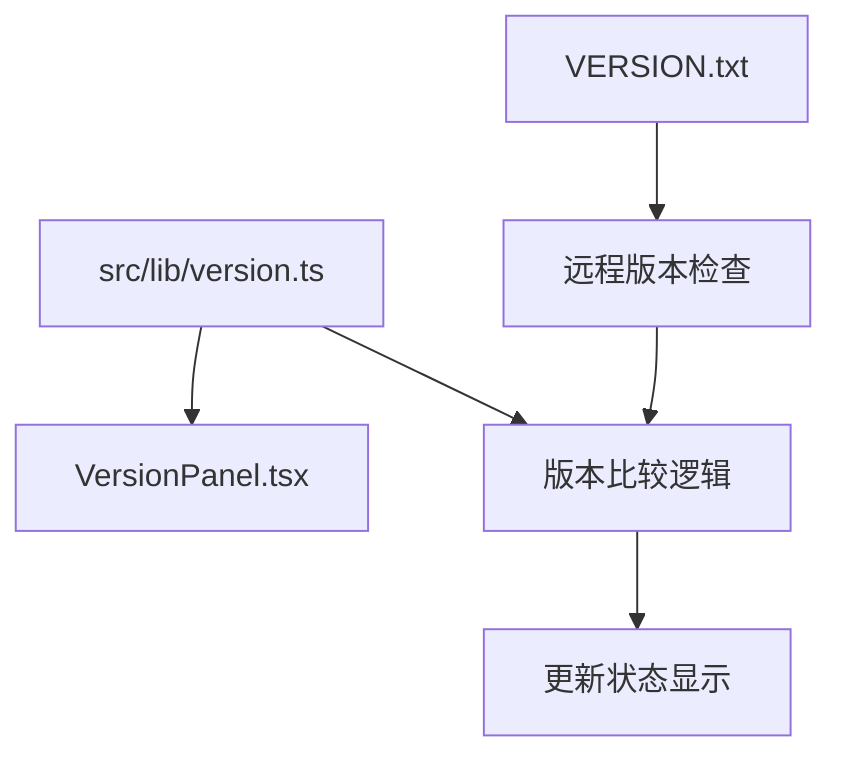

# MoonTV 版本控制系统知识
**文档版本**: v3.2.0
**创建时间**: 2025-10-07
**知识类型**: 版本控制体系

## 📍 版本信息核心文件位置

### 1. 主要版本定义文件
**文件路径**: `src/lib/version.ts:5`
**核心常量**: `CURRENT_VERSION = '3.2.0-dev'`
**作用**: 控制整个应用的版本显示

### 2. 备用版本文件
**文件路径**: `VERSION.txt:1`
**内容**: `v3.2.0`
**作用**: 
- 作为远程版本检查的基准
- CI/CD 自动化脚本使用
- 与 `version.ts` 形成双重验证机制

### 3. 版本显示组件
**文件路径**: `src/components/VersionPanel.tsx:349`
**显示逻辑**: `已是最新版本 v{CURRENT_VERSION}`
**用户界面**: 用户菜单中的版本面板

## 🔍 版本控制数据流程

### 版本信息获取链路


### 双重验证机制
1. **本地版本**: `CURRENT_VERSION` 常量定义当前应用版本
2. **远程检查**: 从 GitHub 获取 `VERSION.txt` 进行版本比较
3. **自动判断**: 系统自动比较本地和远程版本差异

## 🛠️ 版本修改方法

### 方法一：直接代码修改
```typescript
// 文件: src/lib/version.ts (第5行)
const CURRENT_VERSION = 'v3.2.1'; // 修改为想要的版本号
```

### 方法二：批量更新脚本
```bash
# 1. 更新 VERSION.txt
echo "v3.2.1" > VERSION.txt

# 2. 更新 version.ts (使用 sed 命令)
sed -i "s/3.2.0-dev/3.2.1/" src/lib/version.ts

# 3. 或使用 pnpm 脚本 (如果有)
pnpm version:update 3.2.1
```

### 方法三：自动化脚本更新
```javascript
// 参考: scripts/convert-changelog.js
function updateVersionTs(version) {
  const versionTsPath = path.join(process.cwd(), 'src/lib/version.ts');
  let content = fs.readFileSync(versionTsPath, 'utf8');
  content = content.replace(
    /const CURRENT_VERSION = '.*?';/,
    `const CURRENT_VERSION = '${version}';`
  );
  fs.writeFileSync(versionTsPath, updatedContent, 'utf8');
}
```

## 📊 版本检查系统

### 远程版本检查URL配置
```typescript
const VERSION_CHECK_URLS = [
  'https://raw.githubusercontent.com/Stardm0/MoonTV/main/VERSION.txt',
];
```

### 版本比较逻辑
- **相等**: `UpdateStatus.NO_UPDATE` - 无需更新
- **远程 > 本地**: `UpdateStatus.HAS_UPDATE` - 有新版本
- **远程 < 本地**: `UpdateStatus.NO_UPDATE` - 本地更新
- **获取失败**: `UpdateStatus.FETCH_FAILED` - 检查失败

### 版本状态枚举
```typescript
export enum UpdateStatus {
  HAS_UPDATE = 'has_update',     // 有新版本
  NO_UPDATE = 'no_update',       // 无新版本  
  FETCH_FAILED = 'fetch_failed', // 获取失败
}
```

## 🎯 版本显示位置

### 用户界面显示
1. **用户菜单**: 点击用户头像显示版本信息
2. **版本面板**: `VersionPanel.tsx` 组件完整版本信息
3. **登录页面**: `src/app/login/page.tsx` 引用版本检查
4. **健康检查**: `src/app/api/health/route.ts` 包含版本信息

### 显示文本模板
```typescript
// 当无更新时
"已是最新版本 v{CURRENT_VERSION}"

// 当有更新时  
"发现新版本 v{remoteVersion}"

// 版本比较失败时
"版本检查失败"
```

## ⚙️ 版本控制最佳实践

### 版本号格式规范
- **推荐格式**: `vX.Y.Z` (如 `v3.2.1`)
- **开发版本**: `vX.Y.Z-dev` (如 `v3.2.1-dev`)
- **测试版本**: `vX.Y.Z-beta` (如 `v3.2.1-beta`)
- **正式版本**: `vX.Y.Z` (如 `v3.2.1`)

### 文件同步原则
1. **优先更新**: `version.ts` (主要控制文件)
2. **同步更新**: `VERSION.txt` (远程检查基准)
3. **一致性检查**: 确保两个文件版本号一致
4. **自动化脚本**: 使用脚本避免手动错误

### Git 工作流集成
```yaml
# .github/workflows/version-manager.yml
- name: Update version files
  run: |
    # 自动更新版本文件
    node scripts/update-version.js ${{ github.ref_name }}
    
# 自动化版本管理
- name: Commit version updates  
  run: |
    git add VERSION.txt src/lib/version.ts
    git commit -m "chore: update version files for ${{ github.ref_name }}"
```

## 🔧 相关工具和脚本

### 版本转换脚本
**文件**: `scripts/convert-changelog.js`
**功能**: 
- 解析 CHANGELOG.md 生成版本信息
- 自动更新 `VERSION.txt` 和 `version.ts`
- 支持版本号比较和格式化

### 构建时版本注入
**Docker 构建**: 版本信息在构建时注入到镜像中
**健康检查**: API 端点返回当前版本信息
**运行时检查**: 客户端定期检查远程版本更新

## 📝 版本控制相关文件清单

### 核心文件
- `src/lib/version.ts` - 版本控制核心逻辑
- `VERSION.txt` - 远程版本基准文件
- `src/components/VersionPanel.tsx` - 版本显示组件
- `src/lib/changelog.ts` - 版本更新日志

### 脚本文件
- `scripts/convert-changelog.js` - 版本转换脚本
- `scripts/git-setup.sh` - Git 设置脚本
- `.github/workflows/version-manager.yml` - CI/CD 版本管理

### 配置文件
- `package.json:3` - 项目版本 (npm 包版本)
- `CHANGELOG` - 版本变更记录
- `.serena/memories/` - 项目记忆中的版本信息

## 🚀 版本发布流程

### 开发版本发布
1. 更新 `src/lib/version.ts` 中的 `CURRENT_VERSION`
2. 更新 `VERSION.txt` 文件
3. 提交代码并推送到远程仓库
4. 触发 CI/CD 自动构建和部署

### 正式版本发布
1. 创建 Git 标签: `git tag v3.2.1`
2. 推送标签: `git push origin v3.2.1`
3. 更新版本文件并提交
4. 发布新的 Docker 镜像

### 版本回滚
1. 修改 `CURRENT_VERSION` 为之前版本
2. 更新 `VERSION.txt` 文件
3. 重新构建和部署

## 💡 版本控制注意事项

1. **格式一致性**: 始终使用统一的版本号格式
2. **文件同步**: 确保 `version.ts` 和 `VERSION.txt` 一致
3. **语义化版本**: 遵循 Semantic Versioning 规范
4. **自动化优先**: 使用脚本避免手动修改错误
5. **测试验证**: 修改后测试版本显示和检查功能
6. **文档更新**: 同时更新相关文档中的版本信息

## 🔄 版本信息更新检查清单

- [ ] 更新 `src/lib/version.ts` 中的 `CURRENT_VERSION`
- [ ] 更新 `VERSION.txt` 文件内容
- [ ] 验证版本显示组件正常工作
- [ ] 测试远程版本检查功能
- [ ] 更新相关文档中的版本引用
- [ ] 提交代码变更到 Git 仓库
- [ ] 如需要，创建 Git 标签
- [ ] 触发 CI/CD 构建和部署流程

---

**知识完整性**: ✅ 已覆盖版本控制系统的所有核心组件
**维护状态**: 🔄 需要在版本更新时同步更新此文档
**相关文档**: Docker构建标准化、CI/CD工作流、项目配置管理