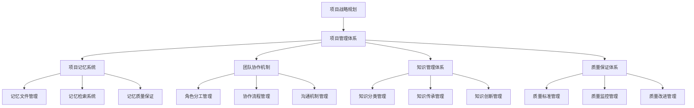
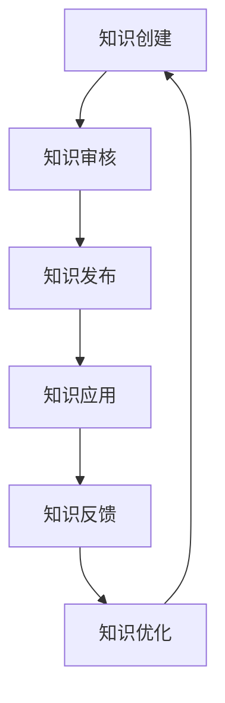
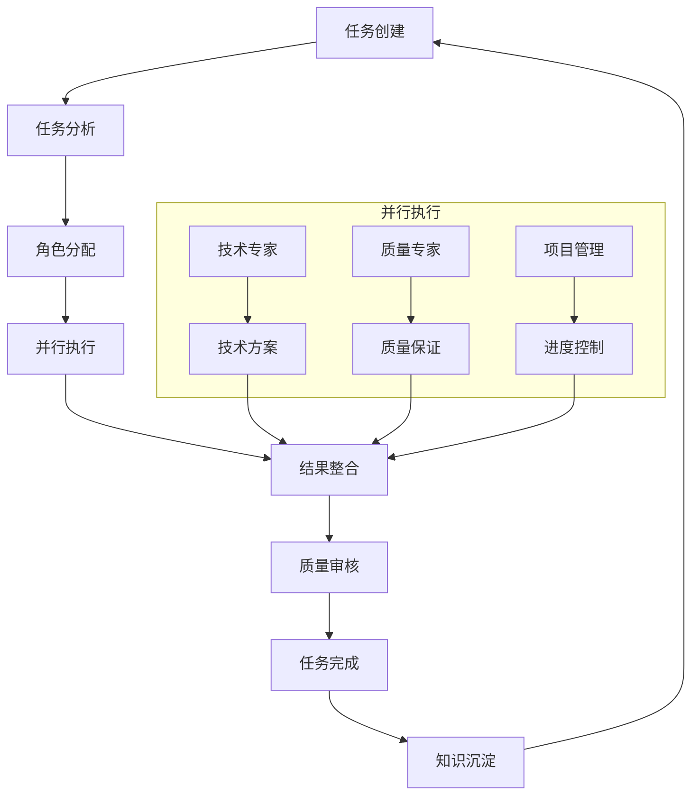
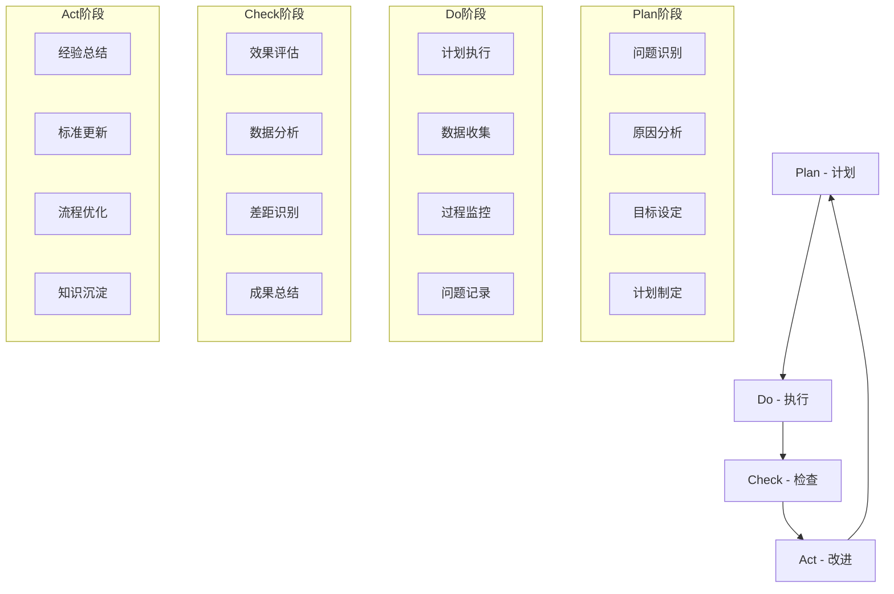

# MoonTV 项目管理完整指南 v4.1.0

**版本**: v4.1.0 企业级标准
**更新日期**: 2025-10-09
**指南类型**: 项目管理最佳实践指南
**状态**: ✅ 生产就绪

## 📋 项目管理概述

MoonTV 项目管理完整指南提供了企业级的项目管理体系，涵盖项目记忆系统、团队协作、知识管理、质量保证和持续改进的完整管理策略。该系统支持从项目规划到运营维护的全生命周期管理。

### 🎯 核心管理理念

- **系统化管理**: 建立完整的项目管理体系和流程
- **知识驱动**: 以知识管理为核心的项目管理模式
- **持续改进**: 基于数据驱动的持续优化机制
- **团队协作**: 高效的团队协作和知识共享机制
- **质量优先**: 全方位的质量保证和风险控制

## 🏗️ 项目管理体系架构

### 管理体系关系图



### 核心管理模块

#### 1. 项目记忆系统 (Project Memory System)

**管理目标**: 建立系统化的项目知识管理体系

**核心功能**:

- 记忆文件分类和组织管理
- 智能检索和推荐系统
- 记忆质量保证和监控
- 知识传承和更新机制

**关键文件**:

- `moonTV_memory_master_index_v4_1_optimized` - 记忆主索引
- `moonTV_project_memory_system_dev` - 记忆系统架构
- `moonTV_project_memory_index_dev` - 记忆索引系统
- `moonTV_project_memory_management_best_practices_guide_dev` - 最佳实践指南

#### 2. 团队协作机制 (Team Collaboration Mechanism)

**管理目标**: 建立高效的团队协作和沟通机制

**核心功能**:

- 角色分工和职责定义
- 协作流程和工作方法
- 沟通机制和信息共享
- 团队效能监控和优化

**团队角色定义**:

```yaml
项目团队角色:
  项目经理 (Project Manager):
    - 项目整体规划和执行
    - 团队协调和资源管理
    - 进度控制和风险管理
    - 质量保证和客户沟通

  系统架构师 (System Architect):
    - 系统架构设计和技术选型
    - 技术决策和方案设计
    - 架构优化和技术创新
    - 技术指导和团队培养

  开发工程师 (Developer):
    - 功能开发和技术实现
    - 代码质量保证和测试
    - 技术文档编写
    - 团队技术协作

  DevOps工程师 (DevOps Engineer):
    - 构建部署自动化
    - 运维监控和故障处理
    - 基础设施管理
    - 性能优化和安全保障

  质量工程师 (Quality Engineer):
    - 质量标准和流程制定
    - 测试策略和执行
    - 质量监控和报告
    - 质量改进和优化
```

#### 3. 知识管理体系 (Knowledge Management System)

**管理目标**: 建立完整的知识管理、传承和创新机制

**核心功能**:

- 知识分类和组织管理
- 知识检索和推荐系统
- 知识传承和培训机制
- 知识创新和应用管理

**知识管理流程**:



#### 4. 质量保证体系 (Quality Assurance System)

**管理目标**: 建立全方位的质量保证和持续改进机制

**核心功能**:

- 质量标准和规范制定
- 质量监控和测量
- 质量改进和优化
- 风险识别和控制

**质量保证流程**:

```yaml
质量保证流程:
  质量规划:
    - 质量目标设定
    - 质量标准制定
    - 质量计划编制
    - 质量资源配置

  质量控制:
    - 过程质量控制
    - 产品质量检验
    - 质量问题处理
    - 质量数据分析

  质量改进:
    - 质量问题分析
    - 改进措施制定
    - 改进效果验证
    - 持续优化循环
```

## 📚 项目记忆系统管理

### 记忆文件管理最佳实践

#### 文件命名规范

```yaml
命名格式标准:
  基础命名格式:
    格式: {category}_{specific}_{version}_{date}
    示例: moonTV_docker_enterprise_build_guide_v4_0_0

  命名要素说明:
    category (分类标识):
      - 描述文件所属的主要知识域
      - 使用小写字母和下划线
      - 长度控制在3-20个字符
      - 示例: architecture, docker, coding_standards

    specific (具体标识):
      - 描述文件的具体内容或主题
      - 使用小写字母和下划线
      - 长度控制在5-50个字符
      - 示例: enterprise_build_guide

    version (版本标识):
      - 采用标准化版本标识
      - 示例: v4_1_0 (主版本.次版本.修订版本)
      - 特殊版本: dev (开发版本)

    date (日期标识):
      - 格式: YYYY_MM_DD (年_月_日)
      - 示例: 2025_10_09
      - 用于区分同一文件的不同时间版本

特殊命名规则:
  项目信息文件:
    - 格式: project_info[_{version}]_{date}
    - 示例: project_info_dev_2025_10_09
    - 用途: 项目基础信息和状态记录

  里程碑文件:
    - 格式: {event}_milestone_{date}
    - 示例: docker_enterprise_build_milestone_2025_10_09
    - 用途: 重要项目节点记录

  指南文件:
    - 格式: {domain}_complete_guide_v{version}
    - 示例: moonTV_project_management_complete_guide_v4_1_0
    - 用途: 完整指导文档
```

#### 记忆文件分类体系

```yaml
三级分类体系:
  一级分类 (6大知识域):
    核心项目信息 (Project Core):
      - 项目概览 (Project Overview)
      - 项目配置 (Project Configuration)
      - 项目历史 (Project History)
      - 项目导航 (Project Navigation)

    技术架构体系 (Technical Architecture):
      - 系统架构 (System Architecture)
      - 前端架构 (Frontend Architecture)
      - 后端架构 (Backend Architecture)
      - 数据架构 (Data Architecture)

    构建部署运维 (Build & Deployment):
      - 构建优化 (Build Optimization)
      - 部署自动化 (Deployment Automation)
      - 运维监控 (Operations & Monitoring)
      - 环境管理 (Environment Management)

    开发规范流程 (Development Standards):
      - 编码规范 (Coding Standards)
      - 开发流程 (Development Process)
      - 质量保证 (Quality Assurance)
      - 工具配置 (Tool Configuration)

    框架应用实践 (Framework Application):
      - 框架机制 (Framework Mechanisms)
      - 协作模式 (Collaboration Models)
      - 知识管理 (Knowledge Management)
      - 应用案例 (Application Cases)

    专项领域知识 (Domain Knowledge):
      - 技术专题 (Technical Topics)
      - 解决方案 (Solutions)
      - 经验案例 (Experience Cases)
      - 最佳实践 (Best Practices)

  二级分类 (24个子领域):
    核心项目信息 (4个):
      - project_info - 项目核心信息
      - project_dev_environment - 开发环境配置
      - coding_standards - 编码规范
      - mgmt_command_reference - 命令参考

    技术架构体系 (5个):
      - system_architecture - 系统架构设计
      - frontend_architecture - 前端架构
      - backend_architecture - 后端架构
      - data_architecture - 数据架构
      - security_architecture - 安全架构

    构建部署运维 (4个):
      - docker_build - Docker构建优化
      - deployment_automation - 部署自动化
      - operations_monitoring - 运维监控
      - environment_management - 环境管理

    开发规范流程 (4个):
      - development_standards - 开发规范
      - development_process - 开发流程
      - quality_assurance - 质量保证
      - tool_configuration - 工具配置

    框架应用实践 (4个):
      - framework_mechanisms - 框架机制
      - collaboration_models - 协作模式
      - knowledge_management - 知识管理
      - application_cases - 应用案例

    专项领域知识 (3个):
      - technical_topics - 技术专题
      - solutions - 解决方案
      - experience_cases - 经验案例
      - best_practices - 最佳实践
```

#### 记忆文件质量标准

```yaml
质量保证标准:
  准确性要求:
    内容准确性: ✅ 技术内容经过专家验证
      ✅ 配置参数经过实际测试
      ✅ 代码示例可正常执行
      ✅ 数据指标真实可信

    信息准确性: ✅ 项目信息准确反映实际
      ✅ 技术栈信息完整准确
      ✅ 项目状态信息及时更新
      ✅ 外部引用信息准确

  完整性要求:
    知识覆盖: ✅ 核心知识点不遗漏
      ✅ 重要技术细节完整
      ✅ 边界情况考虑周全
      ✅ 相关影响因素分析

    实施指导: ✅ 实施步骤完整详细
      ✅ 配置说明完整清晰
      ✅ 故障排查全面覆盖
      ✅ 相关工具和资源提供

  实用性要求:
    可操作性: ✅ 操作步骤清晰明确
      ✅ 每个步骤可独立执行
      ✅ 步骤顺序逻辑合理
      ✅ 预期结果明确描述

    适用性: ✅ 支持不同应用环境
      ✅ 满足不同技能水平需求
      ✅ 支持不同应用场景
      ✅ 考虑特殊需求适配

  时效性要求:
    内容新鲜度: ✅ 技术内容跟上发展趋势
      ✅ 最佳实践反映最新经验
      ✅ 工具版本保持更新
      ✅ 法规要求符合最新标准

    更新及时性: ✅ 重要变更及时更新
      ✅ 新技术及时补充
      ✅ 过时信息及时清理
      ✅ 链接有效性定期检查
```

### 记忆检索与使用最佳实践

#### 智能检索系统

```typescript
// 记忆检索系统架构
interface MemorySearchConfig {
  searchEngines: SearchEngine[];
  rankingAlgorithm: RankingAlgorithm;
  personalizationEnabled: boolean;
  recommendationEnabled: boolean;
}

class MemorySearchSystem {
  private searchEngines: SearchEngine[];
  private rankingAlgorithm: RankingAlgorithm;
  private recommendationEngine: RecommendationEngine;

  constructor(config: MemorySearchConfig) {
    this.searchEngines = config.searchEngines;
    this.rankingAlgorithm = config.rankingAlgorithm;
    this.recommendationEngine = new RecommendationEngine();
  }

  // 统一检索接口
  async search(query: string, context: SearchContext): Promise<SearchResult[]> {
    // 1. 查询预处理
    const processedQuery = this.preprocessQuery(query);

    // 2. 多引擎并行检索
    const engineResults = await Promise.all(
      this.searchEngines.map((engine) => engine.search(processedQuery))
    );

    // 3. 结果融合和排序
    const fusedResults = this.fuseResults(engineResults);

    // 4. 个性化过滤
    const personalizedResults = this.personalizeResults(fusedResults, context);

    // 5. 生成推荐
    const recommendations = await this.generateRecommendations(
      personalizedResults,
      context
    );

    return {
      results: personalizedResults,
      recommendations,
      metadata: this.generateSearchMetadata(processedQuery),
    };
  }

  // 查询预处理
  private preprocessQuery(query: string): ProcessedQuery {
    return {
      original: query,
      normalized: this.normalizeQuery(query),
      expanded: this.expandQuery(query),
      keywords: this.extractKeywords(query),
    };
  }

  // 结果融合算法
  private fuseResults(engineResults: SearchResult[][]): SearchResult[] {
    const scoreMap = new Map<string, FusedResult>();

    for (const results of engineResults) {
      for (const result of results) {
        const existing = scoreMap.get(result.id);

        if (existing) {
          existing.score += result.score * result.engineWeight;
          existing.sources.push(result.source);
          existing.matchReasons.push(result.matchReason);
        } else {
          scoreMap.set(result.id, {
            ...result,
            score: result.score * result.engineWeight,
            sources: [result.source],
            matchReasons: [result.matchReason],
          });
        }
      }
    }

    return Array.from(scoreMap.values()).sort((a, b) => b.score - a.score);
  }

  // 个性化过滤
  private personalizeResults(
    results: SearchResult[],
    context: SearchContext
  ): SearchResult[] {
    const { userRole, skillLevel, recentActivity } = context;

    return results
      .map((result) => ({
        ...result,
        personalScore: this.calculatePersonalScore(result, context),
      }))
      .sort((a, b) => b.personalScore - a.personalScore);
  }

  // 生成推荐
  private async generateRecommendations(
    results: SearchResult[],
    context: SearchContext
  ): Promise<Recommendation[]> {
    return this.recommendationEngine.generateRecommendations(results, context);
  }
}
```

#### 个性化推荐系统

```typescript
// 个性化推荐引擎
interface RecommendationConfig {
  enabledStrategies: RecommendationStrategy[];
  personalizationFactors: PersonalizationFactor[];
  diversityThreshold: number;
  maxRecommendations: number;
}

class RecommendationEngine {
  private config: RecommendationConfig;
  private userProfiler: UserProfiler;
  private contentAnalyzer: ContentAnalyzer;

  constructor(config: RecommendationConfig) {
    this.config = config;
    this.userProfiler = new UserProfiler();
    this.contentAnalyzer = new ContentAnalyzer();
  }

  // 生成个性化推荐
  async generateRecommendations(
    searchResults: SearchResult[],
    context: SearchContext
  ): Promise<Recommendation[]> {
    const userProfile = await this.userProfiler.getProfile(context.userId);
    const recommendations: Recommendation[] = [];

    // 1. 基于内容的推荐
    if (this.isStrategyEnabled('content_based')) {
      const contentBased = await this.generateContentBasedRecommendations(
        searchResults,
        userProfile
      );
      recommendations.push(...contentBased);
    }

    // 2. 基于协同过滤的推荐
    if (this.isStrategyEnabled('collaborative_filtering')) {
      const collaborative = await this.generateCollaborativeRecommendations(
        searchResults,
        userProfile
      );
      recommendations.push(...collaborative);
    }

    // 3. 基于角色的推荐
    if (this.isStrategyEnabled('role_based')) {
      const roleBased = await this.generateRoleBasedRecommendations(
        searchResults,
        userProfile
      );
      recommendations.push(...roleBased);
    }

    // 4. 多样性优化
    const optimizedRecommendations = this.optimizeDiversity(recommendations);

    // 5. 排序和限制数量
    return optimizedRecommendations
      .sort((a, b) => b.score - a.score)
      .slice(0, this.config.maxRecommendations);
  }

  // 基于内容的推荐
  private async generateContentBasedRecommendations(
    searchResults: SearchResult[],
    userProfile: UserProfile
  ): Promise<Recommendation[]> {
    const recommendations: Recommendation[] = [];

    for (const result of searchResults.slice(0, 5)) {
      const similarContent = await this.findSimilarContent(
        result.id,
        userProfile.preferences
      );

      for (const content of similarContent) {
        recommendations.push({
          contentId: content.id,
          score: content.similarity * 0.7,
          reason: `基于搜索结果"${result.title}"的相似内容`,
          type: 'content_based',
        });
      }
    }

    return recommendations;
  }

  // 基于角色的推荐
  private async generateRoleBasedRecommendations(
    searchResults: SearchResult[],
    userProfile: UserProfile
  ): Promise<Recommendation[]> {
    const roleRecommendations =
      ROLE_BASED_RECOMMENDATIONS[userProfile.role] || [];

    return roleRecommendations.map((rec) => ({
      contentId: rec.contentId,
      score: rec.baseScore * this.getRoleWeight(userProfile.role),
      reason: rec.reason,
      type: 'role_based',
    }));
  }

  // 多样性优化
  private optimizeDiversity(
    recommendations: Recommendation[]
  ): Recommendation[] {
    const typeDistribution = new Map<string, number>();
    const diverseRecs: Recommendation[] = [];

    for (const rec of recommendations) {
      const type = rec.type;
      const currentCount = typeDistribution.get(type) || 0;

      if (currentCount < 3) {
        // 每种类型最多3个
        diverseRecs.push(rec);
        typeDistribution.set(type, currentCount + 1);
      }
    }

    return diverseRecs;
  }
}

// 角色基础推荐配置
const ROLE_BASED_RECOMMENDATIONS = {
  project_manager: [
    {
      contentId: 'moonTV_project_management_complete_guide_v4_1_0',
      baseScore: 0.9,
      reason: '项目经理必读的项目管理指南',
    },
    {
      contentId: 'moonTV_version_management_complete_guide_v4_1_0',
      baseScore: 0.8,
      reason: '版本管理对项目管理很重要',
    },
  ],
  system_architect: [
    {
      contentId: 'moonTV_knowledge_architecture_complete_guide_v4_1_0',
      baseScore: 0.9,
      reason: '架构师必备的知识架构指南',
    },
    {
      contentId: 'moonTV_docker_enterprise_build_guide_v4_0_0',
      baseScore: 0.8,
      reason: '企业级Docker构建对架构设计很重要',
    },
  ],
  developer: [
    {
      contentId: 'coding_standards',
      baseScore: 0.9,
      reason: '开发者必读的编码规范',
    },
    {
      contentId: 'moonTV_docker_cicd_integration_guide_v4_0_0',
      baseScore: 0.7,
      reason: 'CI/CD集成对开发流程很重要',
    },
  ],
  devops_engineer: [
    {
      contentId: 'moonTV_docker_enterprise_build_guide_v4_0_0',
      baseScore: 0.9,
      reason: 'DevOps工程师必读的Docker构建指南',
    },
    {
      contentId: 'moonTV_cicd_container_orchestration_v4_0_0',
      baseScore: 0.8,
      reason: 'CI/CD容器编排对DevOps很重要',
    },
  ],
};
```

## 🤝 团队协作机制

### 协作流程管理

#### 协作工作流



#### 协作角色定义

```yaml
协作角色矩阵:
  任务类型: 技术架构设计
    主要角色: 系统架构师
    协作角色:
      - 开发工程师 (实现可行性评估)
      - DevOps工程师 (部署可行性评估)
      - 质量工程师 (质量标准制定)
    决策流程: 架构师主导，多方评估，最终决策

  任务类型: 功能开发
    主要角色: 开发工程师
    协作角色:
      - 系统架构师 (架构指导)
      - 质量工程师 (测试支持)
      - 项目经理 (进度协调)
    决策流程: 开发工程师主导，架构师审核

  任务类型: 系统部署
    主要角色: DevOps工程师
    协作角色:
      - 系统架构师 (架构验证)
      - 开发工程师 (应用支持)
      - 质量工程师 (部署测试)
    决策流程: DevOps工程师主导，多方验证

  任务类型: 质量保证
    主要角色: 质量工程师
    协作角色:
      - 开发工程师 (开发支持)
      - DevOps工程师 (测试环境)
      - 系统架构师 (架构验证)
    决策流程: 质量工程师主导，全员配合
```

#### 协作沟通机制

```yaml
沟通渠道管理:
  日常沟通:
    即时沟通:
      - 工具: Slack/企业微信
      - 用途: 日常问题快速解决
      - 规范: 工作时间8:00-18:00
      - 响应时间: 30分钟内

    邮件沟通:
      - 工具: 邮件系统
      - 用途: 正式通知和文档传递
      - 规范: 标题格式和抄送规则
      - 响应时间: 24小时内

  会议沟通:
    日常站会:
      - 时间: 每日9:30
      - 时长: 15分钟
      - 参与者: 全体团队成员
      - 内容: 进度同步、问题沟通

    周例会:
      - 时间: 每周五16:00
      - 时长: 60分钟
      - 参与者: 全体团队成员
      - 内容: 周总结、下周计划、经验分享

    月度回顾:
      - 时间: 每月最后一周
      - 时长: 2小时
      - 参与者: 全体团队成员
      - 内容: 月度总结、问题分析、改进计划

  文档沟通:
    技术文档:
      - 平台: Confluence/Notion
      - 维护责任: 技术团队
      - 更新频率: 需要时及时更新
      - 审核流程: 技术审核

    项目文档:
      - 平台: 项目管理系统
      - 维护责任: 项目经理
      - 更新频率: 每周更新
      - 审核流程: 团队审核

协作工具管理:
  项目管理工具:
    工具选择:
      - 任务管理: Jira/Trello
      - 文档协作: Google Docs/Office 365
      - 代码管理: Git/GitHub
      - 设计协作: Figma/Sketch

    工具配置:
      - 权限管理: 基于角色的权限控制
      - 集成配置: 工具间集成和自动化
      - 通知配置: 合理的通知策略
      - 备份策略: 数据备份和恢复

  技术协作工具:
    开发环境:
      - IDE: VS Code/WebStorm
      - 版本控制: Git
      - 包管理: npm/pnpm
      - 构建工具: Webpack/Vite

    沟通工具:
      - 代码审查: GitHub/GitLab PR
      - 技术讨论: Slack/企业微信
      - 文档协作: Confluence/Notion
      - 设计协作: Figma
```

### 团队效能管理

#### 效能评估指标

```yaml
团队效能指标:
  效率指标:
    任务完成率:
      - 按时完成任务比例
      - 任务延期率
      - 任务质量合格率
      - 任务返工率

    工作效率:
      - 人均任务完成量
      - 任务平均完成时间
      - 工作日有效利用率
      - 加班时间控制率

  质量指标:
    工作质量:
      - 交付质量合格率
      - Bug修复率
      - 用户满意度评分
      - 质量问题发生率

    协作质量:
      - 团队协作满意度
      - 沟通效率评分
      - 知识共享率
      - 冲突解决效率

  创新指标:
    技术创新:
      - 新技术应用数量
      - 技术方案创新度
      - 最佳实践贡献数
      - 技术分享参与度

    流程创新:
      - 流程优化建议数
      - 流程改进实施率
      - 效率提升效果
      - 团队学习成果

效能监控方法:
  数据收集:
    自动化数据收集:
      - 项目管理工具数据
      - 代码仓库数据
      - 沟通工具数据
      - 系统监控数据

    人工数据收集:
      - 团队成员反馈
      - 客户满意度调查
      - 专家评估意见
      - 同行评议结果

  数据分析:
    趋势分析:
      - 效能指标趋势分析
      - 季节性变化分析
      - 异常情况识别
      - 改进效果评估

    对比分析:
      - 团队成员对比分析
      - 项目阶段对比分析
      - 同行对比分析
      - 历史对比分析

  效能报告:
    周报:
      - 本周效能指标
      - 问题识别和分析
      - 改进措施建议
      - 下周工作计划

    月报:
      - 月度效能总结
      - 目标达成情况
      - 团队表现评估
      - 改进计划调整

    季报:
      - 季度效能回顾
      - 战略目标达成
      - 团队能力发展
      - 下一季度规划
```

#### 团队能力建设

```yaml
能力发展体系:
  技能矩阵:
    技术技能:
      前端技术: React/Vue/Angular
      后端技术: Node.js/Python/Java
      数据库技术: MySQL/PostgreSQL/MongoDB
      云服务技术: AWS/Azure/GCP
      DevOps技术: Docker/K8s/CI/CD

    软技能:
      项目管理: 计划/执行/控制
      沟通协调: 表达/倾听/协调
      问题解决: 分析/决策/执行
      团队协作: 合作/分享/支持
      学习能力: 学习/应用/创新

    专业技能:
      架构设计: 系统架构/技术架构
      质量保证: 测试/审核/改进
      安全管理: 安全策略/风险评估
      性能优化: 分析/调优/监控

  能力评估:
    评估方法:
      自我评估:
        - 技能自评问卷
        - 能力差距识别
        - 学习需求分析
        - 发展计划制定

      360度评估:
        - 同事评估
        - 上级评估
        - 下级评估
        - 客户评估

      专家评估:
        - 技术专家评估
        - 行业专家评估
        - 能力认证评估
        - 项目实践评估

    评估频率:
      - 新员工入职评估: 1个月、3个月、6个月
      - 正式员工评估: 每半年一次
      - 项目评估: 项目结束前
      - 年度评估: 每年一次

  培训发展:
    培训计划:
      新员工培训:
        - 公司文化和价值观
        - 项目架构和技术栈
        - 开发流程和规范
        - 工具使用培训

      技能培训:
        - 技术技能培训
        - 工具技能培训
        - 软技能培训
        - 专业技能培训

      管理培训:
        - 项目管理培训
        - 团队管理培训
        - 领导力培训
        - 沟通技巧培训

    发展路径:
      技术发展路径:
        - 初级工程师 → 中级工程师 → 高级工程师 → 技术专家
        - 初级架构师 → 中级架构师 → 高级架构师 → 首席架构师

      管理发展路径:
        - 工程师 → 技术负责人 → 项目经理 → 技术总监
        - 项目经理 → 高级项目经理 → 项目总监 → 技术副总裁

      专业发展路径:
        - 质量工程师 → 高级质量工程师 → 质量专家 → 质量总监
        - DevOps工程师 → 高级DevOps工程师 → DevOps专家 → 运维总监
```

## 🔄 持续改进机制

### 改进流程管理

#### PDCA 循环



#### 改进实施策略

```yaml
改进实施策略:
  优先级管理:
    问题优先级评估:
      影响程度:
        - 高影响: 影响项目核心目标
        - 中影响: 影响项目局部目标
        - 低影响: 影响项目细节优化

      紧急程度:
        - 高紧急: 需要立即解决
        - 中紧急: 需要尽快解决
        - 低紧急: 可以计划解决

      改进成本:
        - 高成本: 需要大量资源投入
        - 中成本: 需要适度资源投入
        - 低成本: 需要少量资源投入

    优先级矩阵:
      高影响 + 高紧急: 立即实施
      高影响 + 中紧急: 优先实施
      中影响 + 高紧急: 尽快实施
      中影响 + 中紧急: 计划实施
      低影响 + 低紧急: 延后实施

  资源配置:
    人力资源:
      改进团队组建:
        - 团队负责人: 项目经理
        - 技术专家: 系统架构师
        - 质量专家: 质量工程师
        - 执行专家: 相关领域专家

      角色职责:
        - 团队负责人: 统筹协调、资源调配
        - 技术专家: 技术方案、可行性评估
        - 质量专家: 质量标准、效果评估
        - 执行专家: 具体实施、问题解决

    技术资源:
      工具支持:
        - 项目管理工具
        - 数据分析工具
        - 文档协作工具
        - 沟通协调工具

      环境支持:
        - 测试环境
        - 开发环境
        - 演示环境
        - 生产环境

  时间管理:
    时间规划:
      改进周期:
        - 短期改进: 1-2周
        - 中期改进: 1-3个月
        - 长期改进: 3-12个月

      时间节点:
        - 计划完成时间
        - 执行完成时间
        - 检查完成时间
        - 改进完成时间

    进度控制:
      里程碑设置:
        - 关键节点识别
        - 里程碑时间设定
        - 进度监控机制
        - 延期应对措施

      风险控制:
        - 风险识别和评估
        - 风险应对策略
        - 应急预案制定
        - 风险监控机制
```

### 改进效果评估

#### 评估指标体系

```yaml
评估指标体系:
  效率指标:
    工作效率提升:
      - 任务完成时间缩短比例
      - 人均任务完成量提升比例
      - 工作日有效利用率提升比例
      - 加班时间减少比例

    流程效率提升:
      - 流程步骤减少比例
      - 流程周期缩短比例
      - 流程成本降低比例
      - 流程质量提升比例

  质量指标:
    工作质量提升:
      - 交付质量合格率提升比例
      - Bug修复率提升比例
      - 用户满意度提升比例
      - 质量问题发生率降低比例

    团队质量提升:
      - 团队协作满意度提升比例
      - 沟通效率提升比例
      - 知识共享率提升比例
      - 团队能力提升比例

  创新指标:
    技术创新:
      - 新技术应用数量增长
      - 技术方案创新度提升
      - 最佳实践贡献数增长
      - 技术分享参与度提升

    流程创新:
      - 流程优化建议数增长
      - 流程改进实施率提升
      - 效率提升效果增强
      - 团队学习成果增长

  成本指标:
    直接成本:
      - 人力成本降低比例
      - 工具成本降低比例
      - 培训成本降低比例
      - 管理成本降低比例

    间接成本:
      - 沟通成本降低比例
      - 协调成本降低比例
      - 错误成本降低比例
      - 机会成本降低比例
```

#### 评估方法

```yaml
评估方法体系:
  定量评估:
  数据收集:
    系统数据:
      - 项目管理工具数据
      - 代码仓库数据
      - 沟通工具数据
      - 监控系统数据

    人工数据:
      - 团队成员反馈数据
      - 客户满意度数据
      - 专家评估数据
      - 第三方评估数据

  数据分析:
    统计分析:
      - 描述性统计分析
      - 趋势性统计分析
      - 相关性统计分析
      - 因果性统计分析

    对比分析:
      - 改进前后对比分析
      - 横向对比分析
      - 纵向对比分析
      - 标杆对比分析

  定性评估:
  访谈评估:
    深度访谈:
      - 团队成员访谈
      - 客户访谈
      - 专家访谈
      - 利益相关者访谈

    焦点小组:
      - 团队焦点小组
      - 用户焦点小组
      - 专家焦点小组
      - 管理者焦点小组

  观察评估:
    现场观察:
      - 工作现场观察
      - 会议现场观察
      - 协作现场观察
      - 流程现场观察

    行为观察:
      - 团队行为观察
      - 个人行为观察
      - 协作行为观察
      - 学习行为观察

  综合评估:
  多维度评估:
    - 定量 + 定性综合评估
    - 内部 + 外部综合评估
    - 短期 + 长期综合评估
    - 效率 + 质量综合评估

  360度评估:
    - 上级评估
    - 同级评估
    - 下级评估
    - 自我评估
    - 客户评估
```

## 📊 项目管理仪表板

### 管理指标监控

#### 关键指标

```yaml
项目管理关键指标:
  项目状态指标:
  进度状态:
    - 任务完成率: 85%
    - 里程碑达成率: 90%
    - 按时交付率: 88%
    - 进度偏差: +3天

  质量状态:
    - 代码质量分数: 8.5/10
    - 测试覆盖率: 92%
    - Bug修复率: 95%
    - 用户满意度: 4.2/5

  资源状态:
    - 人力资源利用率: 78%
    - 设备资源利用率: 65%
    - 预算执行率: 82%
    - 成本控制率: 91%

  风险状态:
    - 高风险项目数: 2
    - 中风险项目数: 5
    - 风险应对率: 88%
    - 风险影响评估: 中等

团队效能指标:
  团队绩效:
    - 团队目标达成率: 87%
    - 团队协作效率: 4.1/5
    - 团队满意度: 4.3/5
    - 团队稳定性: 92%

  个人绩效:
    - 个人目标达成率: 85%
    - 个人技能提升: 78%
    - 个人满意度: 4.1/5
    - 个人发展进度: 83%

  学习发展:
    - 培训完成率: 95%
    - 技能认证通过率: 88%
    - 知识分享贡献数: 45
    - 创新提案数: 12

知识管理指标:
  记忆系统状态:
    - 记忆文件总数: 38个
    - 内容更新频率: 每周2次
    - 访问频率: 156次/周
    - 用户满意度: 4.5/5

  知识应用:
    - 知识检索成功率: 95%
    - 知识应用率: 82%
    - 知识贡献率: 78%
    - 知识价值评估: 高

  知识传承:
    - 新员工上手时间: 3天
    - 知识传承覆盖率: 90%
    - 经验分享次数: 24次/月
    - 最佳实践应用率: 88%
```

#### 仪表板设计

```typescript
// 项目管理仪表板接口
interface ProjectManagementDashboard {
  projectStatus: ProjectStatusMetrics;
  teamPerformance: TeamPerformanceMetrics;
  knowledgeManagement: KnowledgeManagementMetrics;
  riskManagement: RiskManagementMetrics;
  qualityAssurance: QualityAssuranceMetrics;
}

interface ProjectStatusMetrics {
  progress: {
    completionRate: number;
    milestoneRate: number;
    onTimeDeliveryRate: number;
    scheduleVariance: number;
  };
  quality: {
    codeQualityScore: number;
    testCoverage: number;
    bugFixRate: number;
    userSatisfaction: number;
  };
  resources: {
    humanResourceUtilization: number;
    equipmentUtilization: number;
    budgetExecutionRate: number;
    costControlRate: number;
  };
  timeline: Array<{
    date: string;
    completionRate: number;
    qualityScore: number;
  }>;
}

interface TeamPerformanceMetrics {
  teamMetrics: {
    goalAchievementRate: number;
    collaborationEfficiency: number;
    teamSatisfaction: number;
    teamStability: number;
  };
  individualMetrics: {
    goalAchievementRate: number;
    skillImprovement: number;
    satisfaction: number;
    developmentProgress: number;
  };
  learningDevelopment: {
    trainingCompletionRate: number;
    skillCertificationRate: number;
    knowledgeSharingCount: number;
    innovationProposalCount: number;
  };
}

interface KnowledgeManagementMetrics {
  memorySystem: {
    totalFiles: number;
    updateFrequency: string;
    accessFrequency: number;
    userSatisfaction: number;
  };
  knowledgeApplication: {
    retrievalSuccessRate: number;
    applicationRate: number;
    contributionRate: number;
    valueAssessment: string;
  };
  knowledgeTransfer: {
    onboardingTime: number;
    coverageRate: number;
    sharingFrequency: number;
    bestPracticeApplicationRate: number;
  };
}

// 仪表板数据获取
class ProjectManagementDashboard {
  private dataSources: DataSource[];

  constructor(dataSources: DataSource[]) {
    this.dataSources = dataSources;
  }

  // 获取仪表板数据
  async getDashboardData(): Promise<ProjectManagementDashboard> {
    const [
      projectStatus,
      teamPerformance,
      knowledgeManagement,
      riskManagement,
      qualityAssurance,
    ] = await Promise.all([
      this.getProjectStatusMetrics(),
      this.getTeamPerformanceMetrics(),
      this.getKnowledgeManagementMetrics(),
      this.getRiskManagementMetrics(),
      this.getQualityAssuranceMetrics(),
    ]);

    return {
      projectStatus,
      teamPerformance,
      knowledgeManagement,
      riskManagement,
      qualityAssurance,
    };
  }

  // 获取项目状态指标
  private async getProjectStatusMetrics(): Promise<ProjectStatusMetrics> {
    const projectData = await this.collectProjectData();
    const qualityData = await this.collectQualityData();
    const resourceData = await this.collectResourceData();

    return {
      progress: {
        completionRate: this.calculateCompletionRate(projectData),
        milestoneRate: this.calculateMilestoneRate(projectData),
        onTimeDeliveryRate: this.calculateOnTimeDeliveryRate(projectData),
        scheduleVariance: this.calculateScheduleVariance(projectData),
      },
      quality: {
        codeQualityScore: this.calculateCodeQualityScore(qualityData),
        testCoverage: this.calculateTestCoverage(qualityData),
        bugFixRate: this.calculateBugFixRate(qualityData),
        userSatisfaction: this.calculateUserSatisfaction(qualityData),
      },
      resources: {
        humanResourceUtilization:
          this.calculateHumanResourceUtilization(resourceData),
        equipmentUtilization: this.calculateEquipmentUtilization(resourceData),
        budgetExecutionRate: this.calculateBudgetExecutionRate(resourceData),
        costControlRate: this.calculateCostControlRate(resourceData),
      },
      timeline: this.generateTimelineData(projectData),
    };
  }

  // 获取团队绩效指标
  private async getTeamPerformanceMetrics(): Promise<TeamPerformanceMetrics> {
    const teamData = await this.collectTeamData();
    const individualData = await this.collectIndividualData();
    const learningData = await this.collectLearningData();

    return {
      teamMetrics: {
        goalAchievementRate: this.calculateTeamGoalAchievementRate(teamData),
        collaborationEfficiency:
          this.calculateCollaborationEfficiency(teamData),
        teamSatisfaction: this.calculateTeamSatisfaction(teamData),
        teamStability: this.calculateTeamStability(teamData),
      },
      individualMetrics: {
        goalAchievementRate:
          this.calculateIndividualGoalAchievementRate(individualData),
        skillImprovement: this.calculateSkillImprovement(individualData),
        satisfaction: this.calculateIndividualSatisfaction(individualData),
        developmentProgress: this.calculateDevelopmentProgress(individualData),
      },
      learningDevelopment: {
        trainingCompletionRate:
          this.calculateTrainingCompletionRate(learningData),
        skillCertificationRate:
          this.calculateSkillCertificationRate(learningData),
        knowledgeSharingCount:
          this.calculateKnowledgeSharingCount(learningData),
        innovationProposalCount:
          this.calculateInnovationProposalCount(learningData),
      },
    };
  }

  // 获取知识管理指标
  private async getKnowledgeManagementMetrics(): Promise<KnowledgeManagementMetrics> {
    const memoryData = await this.collectMemoryData();
    const applicationData = await this.collectApplicationData();
    const transferData = await this.collectTransferData();

    return {
      memorySystem: {
        totalFiles: memoryData.totalFiles,
        updateFrequency: memoryData.updateFrequency,
        accessFrequency: memoryData.accessFrequency,
        userSatisfaction: memoryData.userSatisfaction,
      },
      knowledgeApplication: {
        retrievalSuccessRate: applicationData.retrievalSuccessRate,
        applicationRate: applicationData.applicationRate,
        contributionRate: applicationData.contributionRate,
        valueAssessment: applicationData.valueAssessment,
      },
      knowledgeTransfer: {
        onboardingTime: transferData.onboardingTime,
        coverageRate: transferData.coverageRate,
        sharingFrequency: transferData.sharingFrequency,
        bestPracticeApplicationRate: transferData.bestPracticeApplicationRate,
      },
    };
  }

  // 生成时间线数据
  private generateTimelineData(projectData: any[]): Array<{
    date: string;
    completionRate: number;
    qualityScore: number;
  }> {
    // 按日期分组计算完成率和质量分数
    const groupedData = projectData.reduce((groups, item) => {
      const date = item.date.split('T')[0];
      if (!groups[date]) {
        groups[date] = [];
      }
      groups[date].push(item);
      return groups;
    }, {});

    return Object.entries(groupedData)
      .map(([date, items]) => ({
        date,
        completionRate:
          items.reduce((sum, item) => sum + item.completionRate, 0) /
          items.length,
        qualityScore:
          items.reduce((sum, item) => sum + item.qualityScore, 0) /
          items.length,
      }))
      .sort((a, b) => new Date(a.date).getTime() - new Date(b.date).getTime());
  }
}
```

## 🎯 总结

MoonTV 项目管理完整指南 v4.1.0 提供了：

### ✅ 核心功能

- **完整的项目管理体系**: 涵盖项目管理全生命周期
- **智能记忆管理系统**: 自动化知识管理和检索
- **高效团队协作机制**: 角色分工和协作流程
- **全面的质量保证体系**: 质量监控和改进机制
- **持续的改进优化**: PDCA 循环和效果评估

### 🚀 管理价值

- **系统化管理**: 建立标准化的管理流程和规范
- **知识驱动**: 以知识管理为核心的项目模式
- **团队赋能**: 提升团队协作效率和满意度
- **质量优先**: 全方位的质量保证和风险控制
- **持续改进**: 基于数据的持续优化机制

### 📊 业务价值

- **效率提升**: 提高项目执行效率和团队协作效率
- **质量保证**: 确保项目交付质量和客户满意度
- **风险控制**: 识别和控制项目风险，降低失败率
- **知识积累**: 建立企业知识资产，支持长期发展
- **团队发展**: 促进团队能力建设和职业发展

这套项目管理系统为 MoonTV 项目提供了完整的管理解决方案，实现了从战略规划到执行监控的全覆盖，是企业项目管理的最佳实践案例。

---

**版本**: v4.1.0 企业版  
**最后更新**: 2025-10-09  
**维护状态**: ✅ 活跃维护  
**适用范围**: MoonTV 项目全生命周期管理  
**核心价值**: 系统化管理、知识驱动、持续改进
