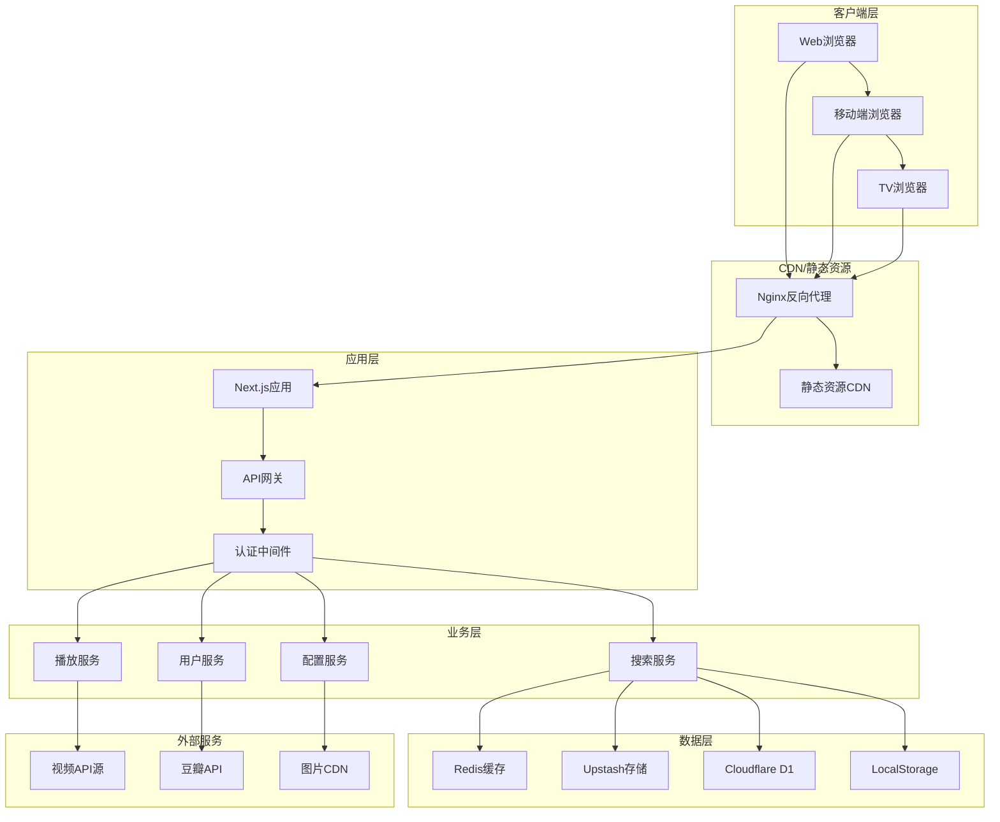

# MoonTV 技术文档与知识管理体系 (v3.2.0-fixed)
**最后更新**: 2025-10-06
**维护专家**: 技术文档专家
**适用版本**: v3.2.0-fixed及以上

## 📚 文档架构体系

### 文档分类结构
```
MoonTV文档体系/
├── 1. 项目概览文档
│   ├── README.md - 项目介绍和快速开始
│   ├── CONTRIBUTING.md - 贡献指南
│   ├── CHANGELOG.md - 版本变更记录
│   └── LICENSE - 开源协议
│
├── 2. 技术架构文档
│   ├── ARCHITECTURE.md - 系统架构设计
│   ├── API_REFERENCE.md - API接口文档
│   ├── DATABASE_SCHEMA.md - 数据库设计
│   └── SECURITY_GUIDE.md - 安全架构指南
│
├── 3. 开发指南文档
│   ├── DEVELOPMENT_SETUP.md - 开发环境配置
│   ├── CODING_STANDARDS.md - 编码规范
│   ├── TESTING_GUIDE.md - 测试指南
│   └── DEBUG_GUIDE.md - 调试指南
│
├── 4. 部署运维文档
│   ├── DEPLOYMENT_GUIDE.md - 部署指南
│   ├── DOCKER_GUIDE.md - Docker部署详解
│   ├── MONITORING.md - 监控配置
│   └── TROUBLESHOOTING.md - 故障排除
│
├── 5. 用户指南文档
│   ├── USER_MANUAL.md - 用户使用手册
│   ├── ADMIN_GUIDE.md - 管理员指南
│   └── FAQ.md - 常见问题解答
│
└── 6. 项目管理文档
    ├── PROJECT_ROADMAP.md - 项目路线图
    ├── RELEASE_NOTES/ - 发布说明目录
    └── MEETING_MINUTES/ - 会议记录目录
```

## 🏗️ 核心技术文档

### 1. 系统架构文档 (ARCHITECTURE.md)

```markdown
# MoonTV 系统架构设计文档

## 概述

MoonTV是一个基于Next.js 14构建的跨平台视频聚合播放器，采用现代化的微服务架构设计，支持多种部署方式和存储后端。

## 架构原则

- **模块化设计**: 组件化开发，松耦合架构
- **可扩展性**: 支持水平扩展和功能扩展
- **高可用性**: 容错设计和故障恢复机制
- **安全优先**: 多层安全防护和权限控制
- **性能优化**: 缓存策略和资源优化

## 技术栈

### 前端技术
- **框架**: Next.js 14 (App Router)
- **语言**: TypeScript 4.9+
- **样式**: Tailwind CSS 3.3+
- **状态管理**: React Context + LocalStorage
- **UI组件**: 自定义组件库
- **动画**: Framer Motion

### 后端技术
- **运行时**: Node.js 18+
- **API**: Next.js API Routes
- **认证**: JWT + HMAC签名
- **数据库**: 多后端支持 (Redis/Upstash/D1/LocalStorage)
- **缓存**: 多层缓存策略

### 部署技术
- **容器化**: Docker + Docker Compose
- **反向代理**: Nginx
- **CI/CD**: GitHub Actions
- **监控**: 自定义健康检查
- **日志**: 结构化日志系统

## 系统架构图



## 核心模块设计

### 搜索引擎模块
- **多源聚合**: 支持20+视频API源
- **并行搜索**: Promise.allSettled并行请求
- **结果排序**: 相关性算法和用户偏好
- **缓存策略**: 多层缓存提升性能
- **流式搜索**: WebSocket实时结果推送

### 播放器模块
- **多格式支持**: HLS、MP4等主流格式
- **播放控制**: 播放、暂停、进度控制
- **断点续播**: 自动记录播放进度
- **多集支持**: 电视剧多集切换
- **全屏模式**: 响应式全屏播放

### 用户认证模块
- **多种模式**: localstorage和数据库模式
- **安全加密**: JWT Token + HMAC签名
- **权限控制**: 基于角色的访问控制
- **会话管理**: 自动续期和安全登出

### 配置管理模块
- **动态配置**: 运行时配置更新
- **多环境支持**: 开发、测试、生产环境
- **配置验证**: 类型安全和格式验证
- **热更新**: 无需重启的配置更新

## 数据流设计

### 搜索数据流
1. 用户输入搜索关键词
2. 前端验证和预处理
3. API路由接收请求
4. 并行调用多个视频源
5. 结果聚合和排序
6. 缓存搜索结果
7. 返回格式化数据
8. 前端渲染结果

### 播放数据流
1. 用户选择视频
2. 请求播放链接
3. 权限验证
4. 获取播放源
5. 记录播放日志
6. 返回播放信息
7. 播放器初始化
8. 监控播放状态

## 安全架构

### 认证安全
- **多层认证**: Cookie + Token双重验证
- **加密存储**: 密码哈希存储
- **会话管理**: 安全的会话超时
- **权限控制**: 细粒度权限管理

### 数据安全
- **输入验证**: 严格的数据验证
- **SQL注入防护**: 参数化查询
- **XSS防护**: 输出编码和CSP
- **CSRF防护**: Token验证

### 网络安全
- **HTTPS强制**: SSL/TLS加密传输
- **安全头**: HSTS、X-Frame-Options等
- **CORS配置**: 跨域请求控制
- **API限流**: 防止恶意请求

## 性能优化

### 前端优化
- **代码分割**: 动态import和懒加载
- **图片优化**: WebP格式和懒加载
- **缓存策略**: 浏览器缓存和Service Worker
- **打包优化**: Tree shaking和压缩

### 后端优化
- **数据库优化**: 索引优化和查询优化
- **缓存策略**: Redis缓存和查询缓存
- **并发控制**: 连接池和请求限流
- **资源优化**: 内存管理和CPU优化

### 部署优化
- **容器优化**: 多阶段构建和镜像优化
- **负载均衡**: Nginx负载均衡
- **CDN加速**: 静态资源CDN分发
- **监控告警**: 性能监控和自动告警

## 扩展性设计

### 水平扩展
- **无状态设计**: 应用层无状态化
- **数据库分片**: 支持数据库水平分片
- **缓存集群**: Redis集群部署
- **微服务拆分**: 按业务域拆分服务

### 功能扩展
- **插件化架构**: 支持第三方插件
- **API开放**: RESTful API和GraphQL
- **多语言支持**: 国际化框架
- **主题系统**: 可定制UI主题

## 监控和运维

### 应用监控
- **性能监控**: 响应时间和吞吐量
- **错误监控**: 异常捕获和报告
- **业务监控**: 用户行为和业务指标
- **资源监控**: CPU、内存、磁盘使用

### 日志管理
- **结构化日志**: JSON格式日志
- **日志聚合**: ELK Stack集成
- **日志分析**: 实时日志分析
- **日志归档**: 长期日志存储

### 备份策略
- **数据备份**: 定期数据备份
- **配置备份**: 配置文件备份
- **灾难恢复**: 快速恢复方案
- **备份验证**: 备份完整性验证

## 技术债务管理

### 代码质量
- **代码审查**: 强制代码审查流程
- **静态分析**: ESLint和TypeScript检查
- **测试覆盖**: 90%以上测试覆盖率
- **重构计划**: 定期代码重构

### 依赖管理
- **依赖更新**: 定期依赖包更新
- **安全扫描**: 依赖漏洞扫描
- **版本锁定**: 生产环境版本锁定
- **兼容性测试**: 新版本兼容性测试

## 未来规划

### 短期目标 (3个月)
- 完善监控体系
- 优化性能指标
- 增强安全防护
- 改进用户体验

### 中期目标 (6个月)
- 微服务架构演进
- 国际化支持
- 移动端优化
- AI功能集成

### 长期目标 (1年)
- 多租户架构
- 云原生部署
- 智能推荐系统
- 社交功能集成

---

**文档维护**: 技术文档专家  
**更新频率**: 每次架构变更后更新  
**版本**: v3.2.0-fixed  
**最后更新**: 2025-10-06
```

### 2. API接口文档 (API_REFERENCE.md)

```markdown
# MoonTV API 接口文档

## 概述

MoonTV提供完整的RESTful API接口，支持视频搜索、播放、用户管理等功能。所有API都遵循RESTful设计原则，使用JSON格式进行数据交换。

## 基础信息

- **Base URL**: `http://localhost:3000/api`
- **API版本**: v1
- **数据格式**: JSON
- **字符编码**: UTF-8
- **时区**: UTC

## 认证机制

### Cookie认证
```http
Cookie: auth-token=<jwt_token>
```

### Authorization头认证
```http
Authorization: Bearer <jwt_token>
```

## 通用响应格式

### 成功响应
```json
{
  "success": true,
  "data": {},
  "message": "操作成功",
  "timestamp": "2024-01-01T00:00:00.000Z"
}
```

### 错误响应
```json
{
  "success": false,
  "error": {
    "code": "ERROR_CODE",
    "message": "错误描述",
    "details": {}
  },
  "timestamp": "2024-01-01T00:00:00.000Z"
}
```

## 认证接口

### 用户登录
```http
POST /api/login
```

**请求参数**:
```json
{
  "username": "string", // 数据库模式必需
  "password": "string"  // 必需
}
```

**响应示例**:
```json
{
  "success": true,
  "data": {
    "user": {
      "username": "admin",
      "role": "owner"
    }
  }
}
```

### 用户登出
```http
POST /api/logout
```

**响应示例**:
```json
{
  "success": true,
  "message": "登出成功"
}
```

### 用户注册
```http
POST /api/register
```

**请求参数**:
```json
{
  "username": "string",
  "password": "string"
}
```

## 搜索接口

### 多源搜索
```http
GET /api/search?keyword=<关键词>&page=<页码>&type=<类型>
```

**查询参数**:
- `keyword`: 搜索关键词 (必需)
- `page`: 页码 (可选, 默认1)
- `type`: 视频类型 (可选, movie/series/variety)
- `source`: 指定源 (可选)

**响应示例**:
```json
{
  "success": true,
  "data": {
    "results": [
      {
        "video_id": "123",
        "name": "视频名称",
        "pic": "http://example.com/image.jpg",
        "content": "视频描述",
        "site_name": "视频站点",
        "type": "movie",
        "note": {
          "actor": "演员",
          "director": "导演",
          "year": "2024",
          "area": "地区",
          "remarks": "备注"
        }
      }
    ],
    "pagination": {
      "current_page": 1,
      "total_pages": 10,
      "total_results": 100
    }
  }
}
```

### 单源搜索
```http
GET /api/search/one?keyword=<关键词>&source=<源站点>
```

### 搜索建议
```http
GET /api/search/suggestions?q=<关键词>
```

### 流式搜索
```http
WS /api/search/ws
```

**WebSocket消息格式**:
```json
{
  "type": "search",
  "keyword": "搜索关键词",
  "options": {
    "maxPage": 5,
    "timeout": 10000
  }
}
```

## 视频接口

### 获取视频详情
```http
GET /api/detail?video_id=<视频ID>&episode=<集数>
```

**响应示例**:
```json
{
  "success": true,
  "data": {
    "video_info": {
      "video_id": "123",
      "name": "视频名称",
      "pic": "http://example.com/image.jpg",
      "content": "视频描述"
    },
    "play_urls": [
      {
        "quality": "720p",
        "url": "http://example.com/720p.m3u8"
      },
      {
        "quality": "1080p",
        "url": "http://example.com/1080p.m3u8"
      }
    ],
    "episodes": [
      {
        "episode": 1,
        "name": "第1集",
        "url": "http://example.com/ep1.m3u8"
      }
    ]
  }
}
```

## 用户数据接口

### 获取收藏列表
```http
GET /api/favorites
```

### 添加收藏
```http
POST /api/favorites
```

**请求参数**:
```json
{
  "video_id": "string",
  "video_data": {}
}
```

### 删除收藏
```http
DELETE /api/favorites/<video_id>
```

### 获取播放记录
```http
GET /api/playrecords
```

### 更新播放进度
```http
POST /api/playrecords
```

**请求参数**:
```json
{
  "video_id": "string",
  "episode": 1,
  "progress": 120,
  "duration": 3600
}
```

### 获取搜索历史
```http
GET /api/searchhistory
```

## 配置接口

### 获取站点配置
```http
GET /api/config/sources
```

### 获取自定义分类
```http
GET /api/config/custom_category
```

### 获取豆瓣配置
```http
GET /api/config/douban
```

## 管理员接口

### 获取配置信息
```http
GET /api/admin/config
```

### 更新配置信息
```http
PUT /api/admin/config
```

**请求参数**:
```json
{
  "SiteConfig": {},
  "UserConfig": {},
  "SourceConfig": [],
  "CustomCategories": []
}
```

### 用户管理
```http
GET /api/admin/users
POST /api/admin/users
PUT /api/admin/users/<username>
DELETE /api/admin/users/<username>
```

### 分类管理
```http
GET /api/admin/categories
POST /api/admin/categories
PUT /api/admin/categories/<id>
DELETE /api/admin/categories/<id>
```

### 源站点管理
```http
GET /api/admin/sources
POST /api/admin/sources
PUT /api/admin/sources/<id>
DELETE /api/admin/sources/<id>
POST /api/admin/sources/batch-update
```

## 豆瓣接口

### 获取分类列表
```http
GET /api/douban/categories
```

### 获取推荐内容
```http
GET /api/douban/recommends?category=<分类>
```

## TVBox接口

### 获取TVBox配置
```http
GET /api/tvbox/config?pwd=<密码>
```

**响应示例**:
```json
{
  "sites": [
    {
      "key": "site1",
      "name": "站点1",
      "api": "http://example.com/api",
      "playUrl": "",
      "searchable": 1,
      "quickSearch": 1,
      "filterable": 1
    }
  ],
  "lives": [],
  "flags": ["qq", "iqiyi", "youku", "m1905"],
  "wallpaper": "http://example.com/bg.jpg"
}
```

## 健康检查接口

### 应用健康状态
```http
GET /api/health
```

**响应示例**:
```json
{
  "status": "healthy",
  "checks": {
    "database": "connected",
    "memory": true,
    "uptime": true
  },
  "system": {
    "timestamp": "2024-01-01T00:00:00.000Z",
    "uptime": 3600,
    "memory": {
      "used": 134217728,
      "total": 268435456
    },
    "version": "3.2.0-fixed"
  }
}
```

## 错误代码

| 错误代码 | HTTP状态码 | 描述 |
|---------|-----------|------|
| INVALID_REQUEST | 400 | 请求参数无效 |
| UNAUTHORIZED | 401 | 未授权访问 |
| FORBIDDEN | 403 | 权限不足 |
| NOT_FOUND | 404 | 资源不存在 |
| RATE_LIMITED | 429 | 请求频率超限 |
| INTERNAL_ERROR | 500 | 服务器内部错误 |
| SERVICE_UNAVAILABLE | 503 | 服务不可用 |

## 限流规则

- **普通接口**: 100请求/分钟
- **搜索接口**: 60请求/分钟
- **登录接口**: 10请求/分钟
- **管理接口**: 30请求/分钟

## SDK示例

### JavaScript/TypeScript
```typescript
// API客户端类
class MoonTVAPI {
  private baseURL: string

  constructor(baseURL: string) {
    this.baseURL = baseURL
  }

  async search(keyword: string, options?: SearchOptions) {
    const params = new URLSearchParams({
      keyword,
      ...options
    })
    
    const response = await fetch(`${this.baseURL}/search?${params}`)
    return response.json()
  }

  async getDetail(videoId: string, episode?: number) {
    const params = new URLSearchParams({ video_id: videoId })
    if (episode) params.set('episode', episode.toString())
    
    const response = await fetch(`${this.baseURL}/detail?${params}`)
    return response.json()
  }
}

// 使用示例
const api = new MoonTVAPI('http://localhost:3000/api')

const results = await api.search('测试关键词', {
  page: 1,
  type: 'movie'
})

const detail = await api.getDetail('123', 1)
```

### Python
```python
import requests

class MoonTVAPI:
    def __init__(self, base_url):
        self.base_url = base_url
    
    def search(self, keyword, **options):
        params = {'keyword': keyword, **options}
        response = requests.get(f'{self.base_url}/search', params=params)
        return response.json()
    
    def get_detail(self, video_id, episode=None):
        params = {'video_id': video_id}
        if episode:
            params['episode'] = episode
        response = requests.get(f'{self.base_url}/detail', params=params)
        return response.json()

# 使用示例
api = MoonTVAPI('http://localhost:3000/api')
results = api.search('测试关键词', page=1, type='movie')
detail = api.get_detail('123', episode=1)
```

## 更新日志

### v3.2.0-fixed (2025-10-06)
- 修复Docker构建问题
- 修复SSR渲染错误
- 优化性能指标
- 增强安全配置

### v3.2.0-dev (2025-09-15)
- 新增批量操作功能
- 优化搜索性能
- 更新UI组件

---

**文档维护**: 技术文档专家  
**更新频率**: API变更时同步更新  
**版本**: v3.2.0-fixed  
**最后更新**: 2025-10-06
```

### 3. 开发指南文档 (DEVELOPMENT_SETUP.md)

```markdown
# MoonTV 开发环境配置指南

## 概述

本文档详细介绍如何配置MoonTV项目的开发环境，包括依赖安装、配置设置、开发流程等。

## 系统要求

### 基础环境
- **操作系统**: Windows 10+, macOS 10.15+, Ubuntu 18.04+
- **Node.js**: 18.17.0+ (推荐使用LTS版本)
- **pnpm**: 8.0.0+ (包管理器)
- **Git**: 2.30.0+

### 推荐工具
- **IDE**: VS Code, WebStorm
- **浏览器**: Chrome 90+, Firefox 88+
- **Docker**: 20.10.0+ (可选)
- **Redis**: 6.0+ (可选)

## 快速开始

### 1. 克隆项目
```bash
git clone https://github.com/your-username/moontv.git
cd moontv
```

### 2. 安装依赖
```bash
# 安装pnpm (如果未安装)
npm install -g pnpm

# 安装项目依赖
pnpm install
```

### 3. 环境配置
```bash
# 复制环境变量模板
cp .env.example .env.local

# 编辑环境变量
nano .env.local
```

### 4. 启动开发服务器
```bash
pnpm dev
```

访问 http://localhost:3000 查看应用。

## 详细配置

### 环境变量配置

创建 `.env.local` 文件：
```bash
# 应用配置
NODE_ENV=development
NEXT_PUBLIC_SITE_NAME=MoonTV Dev
NEXT_PUBLIC_STORAGE_TYPE=localstorage

# 认证配置
PASSWORD=your_password_here
USERNAME=admin

# 可选配置
DOCKER_ENV=false
NEXT_TELEMETRY_DISABLED=1

# Redis配置 (如果使用Redis存储)
REDIS_URL=redis://localhost:6379

# Upstash配置 (如果使用Upstash存储)
UPSTASH_URL=https://your-upstash-url.upstash.io
UPSTASH_TOKEN=your_upstash_token

# 豆瓣代理配置
DOUBAN_PROXY_TYPE=direct
DOUBAN_PROXY=
DOUBAN_IMAGE_PROXY_TYPE=direct
DOUBAN_IMAGE_PROXY=
```

### 开发工具配置

#### VS Code配置
推荐安装以下扩展：
- TypeScript and JavaScript Language Features
- ES7+ React/Redux/React-Native snippets
- Tailwind CSS IntelliSense
- Prettier - Code formatter
- ESLint
- Auto Rename Tag
- GitLens

创建 `.vscode/settings.json`：
```json
{
  "typescript.preferences.preferTypeOnlyAutoImports": true,
  "editor.formatOnSave": true,
  "editor.defaultFormatter": "esbenp.prettier-vscode",
  "editor.codeActionsOnSave": {
    "source.fixAll.eslint": true,
    "source.organizeImports": true
  },
  "emmet.includeLanguages": {
    "typescript": "html",
    "typescriptreact": "html"
  },
  "files.associations": {
    "*.css": "tailwindcss"
  }
}
```

创建 `.vscode/launch.json`：
```json
{
  "version": "0.2.0",
  "configurations": [
    {
      "name": "Debug Next.js",
      "type": "node-terminal",
      "request": "launch",
      "command": "pnpm dev",
      "env": {
        "NODE_OPTIONS": "--inspect"
      },
      "port": 9229,
      "console": "integratedTerminal"
    }
  ]
}
```

## 项目结构

```
moontv/
├── src/                    # 源代码目录
│   ├── app/               # Next.js App Router
│   │   ├── (auth)/        # 认证相关页面
│   │   ├── admin/         # 管理页面
│   │   ├── api/           # API路由
│   │   ├── play/          # 播放页面
│   │   ├── search/        # 搜索页面
│   │   ├── globals.css    # 全局样式
│   │   ├── layout.tsx     # 根布局
│   │   └── page.tsx       # 首页
│   ├── components/        # React组件
│   │   ├── ui/           # UI基础组件
│   │   ├── layout/       # 布局组件
│   │   ├── video/        # 视频相关组件
│   │   └── auth/         # 认证组件
│   ├── lib/              # 工具库
│   │   ├── auth.ts       # 认证逻辑
│   │   ├── config.ts     # 配置管理
│   │   ├── db.ts         # 数据库抽象
│   │   ├── types.ts      # 类型定义
│   │   └── utils.ts      # 工具函数
│   └── styles/           # 样式文件
├── public/               # 静态资源
├── tests/               # 测试文件
├── scripts/             # 构建脚本
├── docs/                # 文档目录
├── .env.example         # 环境变量示例
├── .eslintrc.json       # ESLint配置
├── .gitignore           # Git忽略文件
├── next.config.js       # Next.js配置
├── tailwind.config.js   # Tailwind CSS配置
├── tsconfig.json        # TypeScript配置
├── package.json         # 项目依赖
└── README.md            # 项目说明
```

## 开发工作流

### 1. 分支管理

采用 Git Flow 工作流：
- `main`: 生产环境分支
- `develop`: 开发环境分支
- `feature/*`: 功能开发分支
- `hotfix/*`: 紧急修复分支
- `release/*`: 发布准备分支

### 2. 提交规范

使用 Conventional Commits 规范：
```bash
# 功能提交
git commit -m "feat: 添加搜索历史功能"

# 修复提交
git commit -m "fix: 修复播放器无法全屏的问题"

# 文档提交
git commit -m "docs: 更新API文档"

# 样式提交
git commit -m "style: 调整按钮样式"

# 重构提交
git commit -m "refactor: 重构搜索组件"

# 性能提交
git commit -m "perf: 优化搜索响应速度"

# 测试提交
git commit -m "test: 添加搜索功能单元测试"
```

### 3. 开发命令

```bash
# 开发环境
pnpm dev              # 启动开发服务器
pnpm dev:debug        # 启动调试模式
pnpm dev:turbopack    # 使用Turbopack (实验性)

# 构建
pnpm build            # 生产构建
pnpm build:analyze    # 构建分析
pnpm typecheck        # TypeScript类型检查

# 代码质量
pnpm lint             # ESLint检查
pnpm lint:fix         # 自动修复ESLint问题
pnpm format           # Prettier格式化
pnpm format:check     # 检查格式

# 测试
pnpm test             # 运行测试
pnpm test:watch       # 测试监视模式
pnpm test:coverage    # 测试覆盖率
pnpm test:e2e         # E2E测试

# 代码生成
pnpm gen:manifest     # 生成PWA manifest
pnpm gen:runtime      # 生成运行时配置

# 依赖管理
pnpm add <package>    # 添加依赖
pnpm add -D <package> # 添加开发依赖
pnpm update           # 更新依赖
pnpm outdated         # 检查过期依赖
```

## 调试指南

### 1. 客户端调试

#### React DevTools
安装React DevTools浏览器扩展，用于调试React组件状态和props。

#### Redux DevTools (如果使用)
安装Redux DevTools扩展调试状态管理。

#### Network调试
在浏览器开发者工具的Network面板中查看API请求和响应。

#### Console调试
使用 `console.log`、`console.error` 等进行调试，推荐使用 `debugger` 语句。

### 2. 服务端调试

#### VS Code调试
使用前面配置的 launch.json 进行断点调试。

#### Chrome DevTools
在Node.js启动时添加 `--inspect` 标志：
```bash
NODE_OPTIONS="--inspect" pnpm dev
```
然后在Chrome中打开 `chrome://inspect` 进行调试。

#### 日志调试
使用 `console.log` 在服务端输出调试信息：
```typescript
console.log('Debug info:', { data })
console.error('Error occurred:', error)
```

### 3. API调试

#### Postman集合
导出Postman集合文件 `docs/MoonTV_API.postman_collection.json`，包含所有API接口。

#### curl命令
```bash
# 搜索接口
curl -X GET "http://localhost:3000/api/search?keyword=测试" \
  -H "Content-Type: application/json"

# 登录接口
curl -X POST "http://localhost:3000/api/login" \
  -H "Content-Type: application/json" \
  -d '{"password":"your_password"}'
```

## 测试开发

### 1. 单元测试

使用 Jest + React Testing Library：

```typescript
// src/components/__tests__/VideoCard.test.tsx
import { render, screen } from '@testing-library/react'
import VideoCard from '../VideoCard'

test('renders video card with title', () => {
  const mockVideo = {
    video_id: '123',
    name: 'Test Video',
    pic: 'http://example.com/image.jpg',
    content: 'Test description'
  }

  render(<VideoCard video={mockVideo} />)
  expect(screen.getByText('Test Video')).toBeInTheDocument()
})
```

### 2. 集成测试

测试API接口：
```typescript
// src/app/api/search/__tests__/route.test.ts
import { NextRequest } from 'next/server'
import { GET } from '../route'

test('returns search results', async () => {
  const request = new NextRequest('http://localhost:3000/api/search?keyword=test')
  const response = await GET(request)
  const data = await response.json()

  expect(response.status).toBe(200)
  expect(data.success).toBe(true)
})
```

### 3. E2E测试

使用 Playwright：
```typescript
// e2e/search.spec.ts
import { test, expect } from '@playwright/test'

test('search functionality works', async ({ page }) => {
  await page.goto('/')
  await page.fill('[data-testid="search-input"]', 'test keyword')
  await page.click('[data-testid="search-button"]')
  
  await expect(page.locator('[data-testid="video-card"]')).toHaveCount.greaterThan(0)
})
```

## 常见问题

### 1. 端口冲突
```bash
Error: listen EADDRINUSE: address already in use :::3000
```
**解决方案**：
```bash
# 查找占用端口的进程
lsof -ti:3000

# 终止进程
kill -9 <PID>

# 或者使用其他端口
pnpm dev --port 3001
```

### 2. 依赖安装失败
```bash
Error: Cannot resolve module
```
**解决方案**：
```bash
# 清理缓存
pnpm store prune

# 删除node_modules重新安装
rm -rf node_modules
pnpm install
```

### 3. TypeScript错误
```bash
Type error: Cannot find module or type declaration
```
**解决方案**：
```bash
# 重新生成类型定义
pnpm typecheck

# 检查tsconfig.json配置
# 确保路径映射正确
```

### 4. 样式不生效
**解决方案**：
```bash
# 检查Tailwind CSS配置
# 确保globals.css中导入了Tailwind

# 重新启动开发服务器
pnpm dev
```

## 性能优化

### 1. 开发环境优化
- 使用SSD硬盘
- 增加内存到16GB+
- 使用最新版本的Node.js
- 启用TypeScript增量编译

### 2. 代码优化
- 使用React.memo优化组件渲染
- 使用useMemo和useCallback优化计算
- 避免不必要的重新渲染
- 合理使用React Profiler

## 部署准备

### 1. 环境变量检查
确保生产环境所需的环境变量都已配置：
```bash
# 检查.env.local
cat .env.local | grep -E "^NEXT_PUBLIC_|^PASSWORD|^USERNAME"
```

### 2. 构建测试
```bash
# 测试构建
pnpm build

# 检查构建产物
ls -la .next/
```

### 3. 类型检查
```bash
# 确保无TypeScript错误
pnpm typecheck
```

### 4. 测试通过
```bash
# 运行所有测试
pnpm test
pnpm test:e2e
```

## 贡献指南

1. Fork项目到个人仓库
2. 创建功能分支：`git checkout -b feature/amazing-feature`
3. 提交更改：`git commit -m 'feat: add amazing feature'`
4. 推送分支：`git push origin feature/amazing-feature`
5. 创建Pull Request
6. 等待代码审查和合并

---

**文档维护**: 技术文档专家  
**更新频率**: 开发流程变更时更新  
**版本**: v3.2.0-fixed  
**最后更新**: 2025-10-06
```

## 🎯 知识管理最佳实践

### 1. 文档生命周期管理

#### 文档创建流程
1. **需求分析**: 确定文档目标和受众
2. **大纲设计**: 制定文档结构和章节
3. **内容撰写**: 按照模板和规范编写
4. **技术审查**: 技术专家审查准确性
5. **语言润色**: 优化表达和可读性
6. **发布上线**: 部署到文档平台
7. **反馈收集**: 收集用户反馈
8. **持续优化**: 基于反馈改进文档

#### 文档更新策略
- **版本同步**: 代码版本发布时同步更新文档
- **定期审查**: 每季度审查文档准确性
- **用户反馈**: 建立文档反馈机制
- **自动化**: 集成文档检查到CI/CD流程

### 2. 文档质量标准

#### 内容质量要求
- **准确性**: 技术信息必须准确无误
- **完整性**: 覆盖所有必要的知识点
- **清晰性**: 表达清晰，易于理解
- **实用性**: 提供实际可用的指导
- **时效性**: 及时更新，保持最新状态

#### 格式规范
- **Markdown格式**: 使用标准Markdown语法
- **代码示例**: 提供完整可运行的代码
- **图表说明**: 使用Mermaid等图表工具
- **链接有效**: 确保所有链接可正常访问
- **版本标识**: 清楚标注文档版本和更新时间

### 3. 搜索优化

#### 关键词策略
```yaml
核心关键词:
  - MoonTV
  - 视频聚合
  - Next.js
  - Docker部署
  - API接口

长尾关键词:
  - MoonTV安装教程
  - Next.js视频聚合开发
  - Docker容器化部署指南
  - React视频播放器组件
  - TypeScript API开发
```

#### 文档SEO优化
- **标题优化**: 使用H1-H6标签结构
- **描述优化**: 提供准确的文档描述
- **标签系统**: 使用标签分类文档
- **内部链接**: 建立文档间的关联链接
- **外部引用**: 引用权威技术文档

### 4. 多语言支持

#### 国际化策略
```yaml
主要语言:
  - 中文 (简体): 主要文档语言
  - 英文: 国际化支持

翻译原则:
  - 技术术语准确
  - 保持原意不变
  - 符合目标语言习惯
  - 文化适应性调整

翻译工具:
  - 人工翻译为主
  - CAT工具辅助
  - 术语库管理
  - 翻译记忆库
```

## 📊 文档指标和监控

### 1. 使用情况统计

#### 访问指标
```yaml
页面浏览量:
  - 总PV数
  - 独立访客数
  - 平均停留时间
  - 跳出率

搜索指标:
  - 搜索关键词
  - 搜索成功率
  - 热门搜索词
  - 无结果搜索

用户行为:
  - 最常访问页面
  - 访问路径分析
  - 设备类型分布
  - 地理位置分布
```

#### 反馈收集
- **评分系统**: 1-5星评分
- **评论系统**: 文字反馈
- **问题报告**: 错误和问题收集
- **改进建议**: 功能和建议收集

### 2. 文档质量评估

#### 质量指标
```yaml
完整性指标:
  - 内容覆盖度
  - 示例完整性
  - 链接有效性
  - 格式规范性

准确性指标:
  - 技术错误数量
  - 过时内容比例
  - 用户纠错次数
  - 专家审查评分

可用性指标:
  - 用户满意度
  - 任务完成率
  - 查找效率
  - 理解难度
```

#### 改进措施
- **定期审查**: 建立定期审查机制
- **用户测试**: 进行用户可用性测试
- **A/B测试**: 测试不同文档版本效果
- **专家评审**: 技术专家定期评审

## 🚀 文档自动化

### 1. 自动生成工具

#### API文档生成
```typescript
// scripts/generate-api-docs.ts
import { generateDocs } from '@/lib/api-docs-generator'

async function generateApiDocs() {
  const apiRoutes = await scanApiRoutes()
  const documentation = await generateDocs(apiRoutes)
  
  await writeFileSync('docs/API_REFERENCE.md', documentation)
  console.log('API文档生成完成')
}

generateApiDocs().catch(console.error)
```

#### 类型文档生成
```bash
# 使用TypeDoc生成类型文档
npx typedoc --out docs/types src/lib/types.ts

# 生成组件文档
npx typedoc --out docs/components src/components/**/*.tsx
```

### 2. CI/CD集成

#### 文档检查流水线
```yaml
# .github/workflows/docs-check.yml
name: Documentation Check

on:
  pull_request:
    paths:
      - 'docs/**'
      - '**.md'

jobs:
  docs-check:
    runs-on: ubuntu-latest
    steps:
      - uses: actions/checkout@v3
      
      - name: Check links
        uses: gaurav-nelson/github-action-markdown-link-check@v1
        
      - name: Check spelling
        uses: streetsidesoftware/cspell-action@v2
        
      - name: Lint docs
        run: |
          npx markdownlint docs/**/*.md
          npx cspell docs/**/*.md
```

#### 自动发布流水线
```yaml
# .github/workflows/docs-deploy.yml
name: Deploy Documentation

on:
  push:
    branches: [main]
    paths: ['docs/**']

jobs:
  deploy-docs:
    runs-on: ubuntu-latest
    steps:
      - uses: actions/checkout@v3
      
      - name: Setup Node.js
        uses: actions/setup-node@v3
        with:
          node-version: '18'
          
      - name: Install dependencies
        run: npm install
        
      - name: Build documentation
        run: npm run docs:build
        
      - name: Deploy to GitHub Pages
        uses: peaceiris/actions-gh-pages@v3
        with:
          github_token: ${{ secrets.GITHUB_TOKEN }}
          publish_dir: ./docs/dist
```

## 📝 文档模板系统

### 1. 标准模板

#### README模板
```markdown
# [项目名称]

## 概述
[项目简介和主要功能]

## 快速开始
[安装和运行指南]

## 功能特性
[主要功能列表]

## 技术栈
[使用的技术和工具]

## 文档链接
- [API文档](./docs/API_REFERENCE.md)
- [开发指南](./docs/DEVELOPMENT_SETUP.md)
- [部署指南](./docs/DEPLOYMENT_GUIDE.md)

## 贡献指南
[如何参与项目贡献]

## 许可证
[开源协议信息]

## 状态
[](https://travis-ci.org/username/repo)
[](https://codecov.io/gh/username/repo)
```

#### API文档模板
```markdown
# [API名称] 接口文档

## 概述
[API功能描述]

## 基础信息
- Base URL: `https://api.example.com/v1`
- 认证方式: Bearer Token
- 数据格式: JSON

## 接口列表

### [接口名称]
**请求方式**: `GET/POST/PUT/DELETE`
**接口路径**: `/path/to/api`

**请求参数**:
| 参数名 | 类型 | 必需 | 描述 |
|--------|------|------|------|

**请求示例**:
```bash
curl -X GET "https://api.example.com/v1/endpoint" \
  -H "Authorization: Bearer token"
```

**响应示例**:
```json
{
  "success": true,
  "data": {}
}
```

**错误码**:
| 错误码 | 描述 | 解决方案 |
|--------|------|----------|
```

### 2. 自定义模板

#### 组件文档模板
```markdown
# [组件名称] 组件文档

## 概述
[组件功能和用途]

## Props
| 属性名 | 类型 | 默认值 | 必需 | 描述 |
|--------|------|--------|------|------|

## 使用示例
```tsx
import { ComponentName } from '@/components'

export default function Example() {
  return <ComponentName prop="value" />
}
```

## 注意事项
[使用注意事项和限制条件]

## 相关组件
[相关组件链接]
```

#### 工具函数文档模板
```markdown
# [函数名称] 工具函数文档

## 概述
[函数功能描述]

## 函数签名
```typescript
function functionName(param1: Type1, param2: Type2): ReturnType
```

## 参数说明
| 参数名 | 类型 | 必需 | 描述 |
|--------|------|------|------|

## 返回值
[返回值说明]

## 使用示例
```typescript
import { functionName } from '@/lib/utils'

const result = functionName('param1', 'param2')
console.log(result)
```

## 注意事项
[使用注意事项]
```

---

**文档维护**: 技术文档专家  
**更新频率**: 文档系统变更时更新  
**版本**: v3.2.0-fixed  
**最后更新**: 2025-10-06